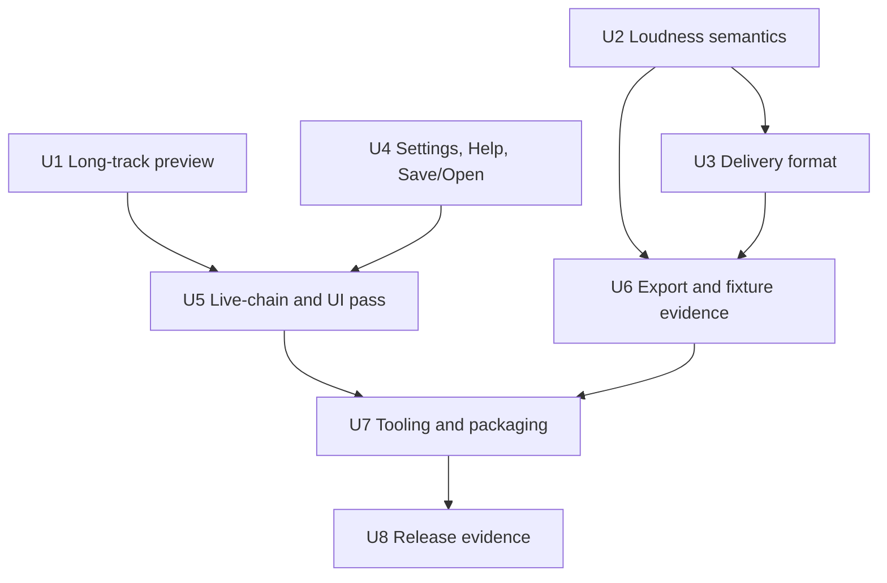

# YES Master Release Candidate Finish Plan

## Problem Frame

`docs/PRODUCT.md` defines YES Master as a private-solid local desktop mastering app: import real audio, analyze it, audition Original vs Mastered at the same playhead, shape the mastering chain quickly, export a technically checked master, and review warnings before treating the output as done.

The release-candidate finish is not a new product pivot. It is the pass that makes the current Track Master experience trustworthy under real use: long-track Mastered preview must not fall over, delivery settings must tell the truth, project/help/settings affordances must be finished, export review must stay advisory for quality issues, and the final UI pass must protect the accepted header layout.

## Source Material

- `docs/PRODUCT.md` - product canon and release-candidate meaning.
- `docs/brainstorms/2026-05-28-release-candidate-hardening-requirements.md` - hardened requirements from the brainstorm pass.
- `docs/APP_BEHAVIOR.md` - current implementation behavior and known gaps.
- `docs/ARCHITECTURE.md` - frontend/backend ownership split and signal-chain direction.
- `docs/RELEASE_STABILIZATION.md` - active gates and implemented stabilization slices.
- `docs/TESTING.md` - fast lane, slow fixture lane, manual listening gate, and packaging commands.
- `docs/HANDOFF_2026-05-27_UI_AND_CLEANUP.md` - accepted header layout and remaining cleanup direction.
- `docs/CODEX_WIRING_REVIEW_2026-05-27.md` - historical wiring review; section 1 is mostly consumed, sections 2 and 3 remain useful risk evidence.
- Recent commits through `e1faeaa docs: expand ui cleanup handoff` - confirm dead-code cleanup and realtime diagnostic counter removal are complete.

## Implementation Assumptions

- Do not start implementation from the brainstorm session without explicit user permission. The expected next move is likely a fresh window that reads this plan and asks before code edits.
- Start implementation from a dedicated branch, not directly on `main`. Recommended branch name: `codex/yes-master-rc-finish`. If a different branch already exists for this work, use that branch and record it in release evidence.
- Work in small, reviewable chunks. Keep mechanical formatting, dependency introduction, behavior changes, UI polish, and docs/evidence in separate commits where practical. Avoid one large omnibus commit.
- Treat this plan as a guardrail, not a script. If repo facts contradict the plan, or a safer implementation path appears during diagnosis, the implementer should make the smallest responsible adjustment and document the reason rather than blindly following stale instructions.
- Start implementation with delivery and project chrome first: sample-rate/bit-depth export behavior, Settings/Help, and Save/Open status feedback. Then move into bounded UI polish and long-track playback hardening unless the user reprioritizes.
- Treat the reported 25-minute Mastered preview non-playback as an edge-case hardening item: silent failure is release-blocking, but a clear recoverable message/fallback is acceptable for this pass.
- Keep both loudness-target entry points: the center quick-select and the right-rail LUFS number control. Either explicit LUFS edit should become one shared settings transition.
- Keep Delivery Profile in the right rail and make it authoritative for profile-owned target, ceiling, and bit-depth values.
- Make Track Master delivery format real. Bit depth and sample-rate conversion are required for this release candidate, and the rendered WAV plus receipt must match the user's delivery choices.
- Finish Settings, Help, Save Project, and Open Project as release-ready current-behavior surfaces. Settings should cover baseline app defaults: audio/preview behavior, export defaults, project/session behavior, and basic app info.
- Preserve the accepted top/header layout: `Track Master / Album Master` centered, track identity/meta on the left, and Original/Mastered plus preview toggles in the track header.
- Do not canonize "no smart features." Optional future per-track analysis and click-to-apply suggestions for level, compression, EQ, and related controls are product-aligned; the preferred future shape is an Analyze Suggestions / Apply panel. Silent auto-mastering or professional replacement claims are not in this pass.
- Do not restore production diagnostic counters. If instrumentation is needed again, add it behind a dev-only path and remove or document it before signoff.
- Run local private slow lanes because private fixture inputs exist on this machine. Commit only aggregate conclusions.
- Rust formatting is a tooling hygiene gate, not a product decision: `cargo fmt` reformats Rust code consistently so later Rust edits stay reviewable.
- Install the missing Clippy component during implementation if it is still absent.

## Scope Boundaries

### In Scope

- Track Master release-candidate stabilization.
- Long-track Mastered preview reliability, especially with Preview LUFS enabled.
- Loudness target and delivery profile semantics that stay truthful across the center quick-select and right-rail controls.
- Track Master delivery format polish: bit depth wired and sample-rate conversion implemented.
- Save/Open Project, baseline Settings, and Help surfaced as real user-facing flows.
- Live-chain update regression coverage around Original/Mastered switching, undo/redo, and edits while paused or playing.
- Bounded broader UI polish where the current look still feels unfinished, especially first-screen spacing, title treatment, Visual EQ, wasted control rows, scrolling friction, status affordance placement, and CSS layout debt that blocks straightforward adjustment.
- Private-fixture, private-reference, and manual-listening evidence when local inputs are available.
- Windows packaging verification.
- Release evidence and docs cleanup.

### Deferred to Follow-Up Work

- Optional smart analysis centered on an Analyze Suggestions / Apply panel with per-track suggested level/compression/EQ moves that the user can choose to apply.
- A larger preference system beyond baseline release-needed Settings.
- Full Album Master delivery-format parity. Album Master may keep its current same-sample-rate limitation for this pass; document any user-facing limitation rather than silently implying Track Master parity.
- Subjective Oomph or preset retuning without fresh listening notes.
- Larger Album Master dashboard/report expansion.
- New reference-track UX.
- Public signing, notarization, autoupdate, and store-style distribution.

### Out of Scope

- Silent automatic smart adjustments.
- Claims that YES Master replaces certified mastering judgment.
- Preventing all risky creative choices. The product canon allows bold choices as long as meters, checks, and export review make consequences visible.
- Committing private audio, rendered private masters, private fixture ledgers, or fixture-derived waveform images.

## Requirements Traceability

| Product requirement | Plan coverage |
| --- | --- |
| Long-track Mastered preview does not silently fail | U1, U5, U8 |
| Import/analyze/audition/export is stable | U1, U2, U3, U6, U7 |
| Original vs Mastered audition remains same-playhead and responsive | U1, U5 |
| Delivery profile and delivery format are truthful | U2, U3 |
| Safe path is obvious without blocking taste-led choices | U2, U3, U4, U6 |
| Save/Open Project, Settings, and Help are real surfaces | U4, U8 |
| Export warnings are advisory, technical failures still block | U6 |
| Compressor Off bypasses creative/preset compression only | U6 slow-lane verification, existing `src-tauri/src/dsp.rs` tests |
| Volume Match is audition-only and does not affect export | U6 slow-lane verification, existing `src-tauri/tests/export_volume_match.rs` |
| Manual listening gate exists for release-candidate signoff | U6, U8 |
| Windows packaging works locally | U7 |
| Temporary instrumentation removed or documented | Completed by `58c25d7`; U8 records that status |

## Key Decisions

1. Treat long-track Mastered preview non-playback as a hardening gate.
   Rationale: 25-minute sources are edge cases, but silent transport failure destroys trust. For this pass, a clear recoverable message or fallback is acceptable if full long-track preview reliability would require a larger rewrite.

2. Keep smart assistance as future-aligned, not identity-rejected.
   Rationale: YES Master should not promise to replace mastering judgment, but optional, reviewable, click-to-apply track analysis belongs naturally in the product's future. The preferred future UX is an Analyze Suggestions / Apply panel.

3. Make delivery format real before release-candidate signoff.
   Rationale: the user needs Track Master WAV exports at the required delivery sample rate and bit depth, especially when starting from compressed sources. The app should support high-quality conversion without implying that upsampling restores information already lost to compression. Album Master parity is intentionally deferred unless it proves small and low-risk.

4. Finish current top-level affordances before adding new ones.
   Rationale: Settings and Help are visible today, Save/Open already exist, and dead or unclear chrome undermines trust more than a missing advanced preference does. Settings should be baseline app defaults, not a deep preferences system.

5. Preserve the accepted header layout.
   Rationale: `docs/HANDOFF_2026-05-27_UI_AND_CLEANUP.md` records the final direction after several rejected variants. Final UI work should protect that direction.

6. Use private audio only as local evidence.
   Rationale: `docs/PRIVATE_AUDIO_FIXTURES.md` is explicit that private sources, rendered masters, fixture ledgers, and waveform images stay out of git. The repo should receive aggregate interpretation only.

7. Do not retune subjective presets without listening notes.
   Rationale: the product docs call Oomph least matched in the current reference snapshot, but automated reference gaps are not a listening substitute.

8. Keep final UI polish grounded in first principles before human taste review.
   Rationale: the next UI pass should first remove obvious layout debt, restore simple symmetry, and use clear row/column math at the target desktop viewport. After that mechanical cleanup, subjective signoff can involve the user without turning every spacing decision into a blocker.

## Existing Patterns To Follow

- Frontend settings transitions live in `src/lib/settings-transitions.ts` with coverage in `src/lib/settings-transitions.test.ts`.
- Effective UI display helpers live in `src/lib/effective-settings.ts` with mirrored Rust behavior in `src-tauri/src/types.rs`.
- Track Master orchestration lives in `src/hooks/useTrackMaster.ts`, with integration-style coverage in `src/hooks/useTrackMaster.integration.test.tsx`.
- Playback and live-chain behavior live in `src-tauri/src/audio.rs` and `src-tauri/src/sources.rs`.
- Right-rail quality/export behavior lives in `src/components/RightRail.tsx`, with coverage in `src/components/RightRail.test.tsx`.
- Export checks live in `src-tauri/src/exports.rs`, with backend contract coverage in `src-tauri/tests/contracts.rs`.
- Packaging invariants are already covered by `src/lib/windows-app-packaging.test.ts`.

## Implementation Dependency Map



## Execution Operating Model

- Work from a dedicated branch such as `codex/yes-master-rc-finish`; do not make this RC run directly on `main`.
- Keep commits small and explainable. Suggested chunks are: planning docs, mechanical Rust formatting if needed, SRC dependency/helper tests, Track Master SRC render path, frontend delivery-format UI/state, Settings/Help/Save/Open, UI/CSS polish, long-track playback hardening, export evidence, packaging/docs.
- Keep unrelated review artifacts, private fixtures, generated audio, rendered masters, and screenshots out of commits unless the user explicitly asks to preserve a specific artifact.
- Prefer characterization tests before changing risky behavior, especially SRC, long-track playback, live-chain predicate logic, and project open/recovery state.
- Use the plan as a map, not a cage. The implementer may change sequencing when diagnosis shows a safer order, but release evidence should record material deviations and why they were safer.

## Execution Start Rule

This plan is ready for implementation, but code work must not start until the user explicitly gives permission in the current session. If resuming from a new window, read this file and `docs/brainstorms/2026-05-28-release-candidate-hardening-requirements.md`, confirm the repo path, then ask before making code edits.

Recommended first work block:

1. Create or switch to the dedicated RC branch and take a clean baseline status.
2. U3 - Track Master sample-rate/bit-depth delivery format.
3. U4 - baseline Settings, contextual Help, Save/Open status feedback.
4. U5 - bounded UI polish.
5. U1 - long-track playback hardening if not already exposed during the delivery/UI work.

## Implementation Units

### U1 - Reproduce And Harden Long-Track Mastered Preview

**Goal:** A long track around 25 minutes must not fail silently in Mastered playback; it should play when possible or show a clear recoverable message/fallback.

**Files:**

- `src/hooks/useTrackMaster.ts`
- `src/hooks/useTrackMaster.integration.test.tsx`
- `src/lib/api.ts`
- `src-tauri/src/audio.rs`
- `src-tauri/src/sources.rs`
- `src-tauri/src/decode.rs`
- `docs/RELEASE_EVIDENCE_2026-05-28.md`

**Approach:**

- Reproduce the reported non-playback with a local long track if available. If no suitable private file is available, create or use a generated local-only long synthetic WAV for mechanical playback stress.
- Measure the failure shape before changing code: hang, timeout, silence, delayed start, memory spike, failed seek, broken Preview LUFS worker, or PC/audio-device limitation.
- Inspect the full-PCM playback path for avoidable copies and cache amplification on long files. Treat Preview LUFS as one possible symptom, but do not assume it is the bottleneck because the preview landing worker already uses a bounded analysis window.
- Check the cold-path timeout behavior for long files that were not prewarmed. A timeout must become visible recoverable UI state rather than a silent transport failure.
- Keep Mastered playback usable when practical. Acceptable RC outcomes are accurate preview, delayed-but-clear preview readiness, or a clear fallback/message that tells the user the long-file Mastered preview could not be prepared while export remains available.
- Preserve Original/Mastered same-playhead switching and seek behavior while making the long-track path safer.
- Capture aggregate local evidence only; do not commit private audio or generated large WAVs.

**Test Scenarios:**

- Mastered playback on a long input either starts or surfaces a clear recoverable message without leaving the transport appearing broken.
- Cold-path `play_master` on a long input that is not prewarmed either succeeds or returns a clear user-visible error before the app appears stuck.
- Switching Original to Mastered mid-playback uses the estimated playhead and does not restart from zero unless the track is truly at end.
- Seeking on a long loaded Mastered source remains responsive or returns a clear recoverable error.
- Preview/long-file fallback, if used, is visible and does not leave the app in an inconsistent transport state.
- Memory or decode-cache behavior is covered by a focused backend test or documented release evidence, with attention to avoiding unnecessary extra full-PCM copies on long files.

### U2 - Make Loudness Target Writes Atomic And Truthful

**Goal:** The center loudness quick-select and the right-rail LUFS target control must always agree on what the chain will actually target.

**Files:**

- `src/App.tsx`
- `src/hooks/useTrackMaster.ts`
- `src/lib/settings-transitions.ts`
- `src/lib/settings-transitions.test.ts`
- `src/lib/effective-settings.ts`
- `src/lib/effective-settings.test.ts`
- `src/hooks/useTrackMaster.integration.test.tsx`

**Approach:**

- Verify the current right-rail advanced helper still flips profile-owned fields to `custom` correctly.
- Replace the center quick-select split-callback flow with one hook-level operation for explicit loudness-target edits.
- Route both loudness surfaces through the same transition path.
- Preserve Delivery Profile card behavior: choosing a named delivery profile still sets profile-owned target, ceiling, and bit depth together.
- Keep display text derived from effective settings rather than raw advanced fields.

**Test Scenarios:**

- Starting on `delivery_profile: "streaming-universal"` with no raw LUFS override, choosing `Off / Natural` from the center loudness quick-select produces `delivery_profile: "custom"` and an effective target of `null`.
- Starting on a non-Custom profile, typing `-12.0` into the right-rail LUFS target produces `delivery_profile: "custom"` and an effective target of `-12.0`.
- Starting on `custom` with a custom LUFS value, choosing a named Delivery Profile restores that profile's target, ceiling, and bit depth together.
- Repeated center quick-select changes in one render tick do not leave a mismatch between dropdown display, readout, and selected settings.

### U3 - Wire Track Master Bit Depth And Sample-Rate Conversion

**Goal:** Track Master Delivery Profile and Delivery Format must control the actual render outcome, especially bit depth and sample rate.

**Files:**

- `src/App.tsx`
- `src/hooks/useTrackMaster.ts`
- `src/bindings.ts`
- `src/lib/effective-settings.ts`
- `src/lib/effective-settings.test.ts`
- `src/lib/settings-transitions.ts`
- `src/lib/settings-transitions.test.ts`
- `src-tauri/Cargo.toml`
- `src-tauri/src/types.rs`
- `src-tauri/src/engine.rs`
- `src-tauri/src/wav_writer.rs`
- `src-tauri/tests/contracts.rs`
- `src-tauri/tests/delivery_profile_render.rs`

**Approach:**

- Confirm rendered WAV bit depth follows effective Delivery Profile or Custom settings.
- Treat sample-rate conversion as a real export/DSP feature, not a UI wiring task. Add a high-quality Rust SRC dependency unless implementation research finds a safer local alternative; `rubato` is the recommended default because it is pure Rust and avoids native deployment dependencies.
- Add `MasteringSettings::effective_sample_rate(source_sample_rate)` or an equivalent helper that mirrors the existing profile-shadows-advanced pattern while preserving `Custom Source`.
- Mirror sample-rate semantics in the frontend with `DELIVERY_PROFILE_SAMPLE_RATE` and `effectiveSampleRate`.
- Update `applyDeliveryProfileSelection` so named profiles write `target_sample_rate` alongside target LUFS, ceiling, and bit depth. When switching to `custom`, preserve the currently effective sample rate rather than falling back to stale hidden state.
- Define Custom sample-rate encoding simply: `target_sample_rate: null` means Source, and `Some(44100 | 48000 | 96000)` means convert to that rate. If 96 kHz support proves risky or low-quality with the chosen SRC path, omit it from RC UI and document the choice.
- Implement sample-rate conversion for Track Master export so the rendered WAV can match the selected delivery rate.
- Make export receipts and review text report effective/rendered bit depth, not stale raw advanced fields.
- Make export receipts and review text report rendered sample rate.
- Ensure named profiles apply their intended sample-rate recommendation: CD at 44.1 kHz, streaming/video/broadcast-style profiles at 48 kHz unless product docs specify otherwise.
- Make Custom allow explicit supported rates: Source, 44.1 kHz, 48 kHz, and 96 kHz if the conversion path can support it cleanly.
- Keep copy honest: sample-rate conversion supports delivery requirements and high-quality WAV output, but does not claim to restore detail lost in compressed sources.
- Add a delivery-integrity check that treats requested-rate vs rendered-rate mismatch as a technical failure or critical export check.
- Consider a gentle advisory for upsampling compressed sources only if it can be worded without implying quality restoration.
- Do not expand U3 into full Album Master delivery parity unless the implementation is clearly small and low-risk. Otherwise document Album Master's existing same-sample-rate limitation in release evidence and user-facing copy where needed.

**Test Scenarios:**

- CD profile renders and reports 16-bit output.
- Streaming/Loud/Vinyl/Broadcast profiles render and report their effective bit depth.
- Custom 32-bit float renders and reports 32-bit float output.
- 44.1 kHz source exported to a 48 kHz delivery profile renders a 48 kHz WAV and receipt.
- 48 kHz source exported to CD renders a 44.1 kHz WAV and receipt.
- Custom Source preserves the source sample rate.
- Custom 44.1/48 kHz renders the selected sample rate.
- Named profile selection populates the visible/effective sample-rate default, and switching to Custom preserves the effective profile sample rate until the user changes it.
- Export receipt sample rate matches the rendered file header.
- The existing no-SRC contract assertion is replaced with a test that pins converted output sample rate.
- `delivery_profile_render.rs` asserts sample rate for cross-rate cases such as 48 kHz source to CD and 44.1 kHz source to streaming/broadcast.
- A requested-rate/rendered-rate mismatch is surfaced as a technical failure or critical export check.

### U4 - Finish Baseline Settings, Help, Save Project, And Open Project

**Goal:** Top-level project and support affordances should feel finished and explain current behavior.

**Files:**

- `src/App.tsx`
- `src/App.css`
- `src/hooks/useTrackMaster.ts`
- `src/hooks/useTrackMaster.integration.test.tsx`
- `src-tauri/src/project.rs`
- `src/lib/preview-mock.ts`

**Approach:**

- Keep explicit Save As / Open Project for `.ams.json`; these flows are already wired through the hook and Tauri project commands, so U4 is mainly user-facing status, recovery, Settings, and Help.
- Add a hook-level project feedback state or equivalent status channel for successful save/open, cancelled dialogs, unsupported schema, missing files, and re-analysis/waveform recovery failures where user action is needed.
- Do not add Save-vs-Save-As overwrite behavior or an autosave-first project system in this pass unless it already falls out of existing project state with no extra risk.
- Replace "not yet wired" Settings and Help affordances with real panels or dialogs.
- Scope Settings to baseline supported app defaults: audio/preview behavior, export defaults, project/session behavior, and basic app info. Do not invent a deep preference system unless a setting is already backed by real behavior.
- Use existing frontend state/session/localStorage patterns for any RC-level setting that truly needs persistence. If a new persistent app-defaults store becomes necessary, keep it small and document the storage path; do not grow a general settings subsystem in this pass.
- Scope Help to a contextual in-app panel with short sections for Import/Analyze, Original vs Mastered, Volume Match vs Preview LUFS, Delivery Profile/Format, Export Review, and Save/Open Project.
- Ensure Settings/Help can open and close without mutating mastering settings, stopping playback, or losing selection.

**Test Scenarios:**

- Clicking Settings opens a baseline app-defaults surface without changing mastering settings.
- Clicking Help opens a contextual in-app help panel with current-behavior guidance.
- Save Project success produces visible feedback.
- Open Project success produces visible feedback.
- Cancelled Save/Open dialogs do not show scary errors or mutate project state.
- Open Project restores project state, selects the first track, and prewarms it when possible.
- Unsupported project schema, moved source files, re-analysis failures, and waveform recovery failures surface clear errors or per-track unavailability indicators instead of only logging to the console.

### U5 - Harden Live-Chain Predicates And Final UI Trust

**Goal:** Live edits should reach the loaded Mastered chain exactly when they should, and the final UI should feel more finished without reopening layout exploration.

**Files:**

- `src/App.tsx`
- `src/App.css`
- `src/App.layout-css.test.ts`
- `src/hooks/useTrackMaster.ts`
- `src/hooks/useTrackMaster.integration.test.tsx`
- `src/components/RightRail.tsx`
- `src/components/RightRail.test.tsx`
- `src/lib/preview-mock.ts`

**Approach:**

- Extract or clarify the repeated "currently loaded as master" predicate used by settings edits, user presets, undo/redo, and album intent edits.
- Keep the conservative behavior that accepts both synchronous loaded-kind state and backend tick state, but make source playback and unknown playback explicit cases.
- Before visual tweaks, inspect `src/App.css` for obvious layout debt that makes adjustment fragile: conflicting overrides, unnecessary `!important`, hard-coded compensation values, and one-off `auto`/width rules that fight the intended grid. Refactor only the local console/rail/header CSS needed for this pass; do not start a whole-app CSS rewrite.
- Prefer simple mathematical layout patterns for symmetry: consistent column tracks, row gaps, shared panel widths, stable toolbar dimensions, and predictable alignment between the main surface and right rail.
- Preserve the centered top mode switch and track-header placement of Original/Mastered, Volume Match, and Preview LUFS.
- Fix first-screen spacing and the oddly spaced hero/title treatment.
- Move or reframe the `ANALYZED` pill so it belongs with source-check/right-rail status rather than floating awkwardly in the track header.
- Refine the current Visual EQ rather than hiding or replacing it: make it calmer, tighter, less toy-like, and better integrated with the mastering surface.
- Remove the mostly empty undo/redo/ready strip. Move readiness near track metadata or source/right-rail status, and make undo/redo compact tool affordances rather than a dedicated row.
- Aim for a single-panel working surface where advanced controls and compression can be active without awkward up/down scrolling or cramped layout.
- Prefer denser main controls while preserving the current ownership model: main surface for sound shaping, right rail for delivery/quality.
- Keep the compact modifier summary only if it reads as user-facing state, not debug instrumentation.
- Check desktop layout after Settings/Help and delivery-format changes.
- Use `1920x1080` as the primary UI acceptance viewport. Capture before/after screenshots under ignored `test-output/`, inspect them, and record aggregate conclusions in release evidence rather than committing screenshots.
- After first-principles CSS/layout cleanup, involve the user for visual taste/signoff rather than freezing every spacing decision in the plan.

**Test Scenarios:**

- While playing Mastered, changing intensity or EQ sends one coalesced `api.updateChain` call with changed settings.
- While playing Original, changing intensity does not send `api.updateChain`.
- While paused with Mastered loaded, changing EQ or output gain updates the loaded master chain so the next resume uses the new settings.
- Undo/redo restores settings and pushes to the live chain only when the affected master is loaded.
- Accepted header layout tests continue to assert preview controls stay in the track header and waveform deck remains clean.
- CSS structure no longer relies on obvious conflicting overrides or one-off compensation rules in the edited header/console/rail areas.
- First-screen screenshot review at `1920x1080` no longer shows awkward title spacing, crowded header spacing, or a floating `ANALYZED` pill.
- Visual EQ no longer reads as an unfinished or mismatched component.
- Undo/redo/ready no longer occupy a mostly empty dedicated row.
- Advanced controls and compression can be reached in the working surface without awkward scroll juggling at the target desktop viewport.

### U6 - Prove Export Review On Real And Already-Processed Inputs

**Goal:** Export review should remain visibly advisory for quality warnings and blocking only for technical write/render failures, including already-processed material.

**Files:**

- `src/components/RightRail.tsx`
- `src/components/RightRail.test.tsx`
- `src-tauri/src/exports.rs`
- `src-tauri/tests/contracts.rs`
- `src-tauri/examples/private_fixture_matrix.rs`
- `src-tauri/examples/private_reference_tuning.rs`
- `docs/PRIVATE_AUDIO_FIXTURES.md`
- `docs/RELEASE_STABILIZATION.md`
- `docs/RELEASE_EVIDENCE_2026-05-28.md`

**Approach:**

- Re-run the already-mastered matrix using the local private fixture manifest when available.
- Re-run private reference tuning using the local references directory when available.
- If slow-lane evidence shows missing warnings for hot, low-dynamic-range, true-peak-risk, or already-compressed cases, patch warning logic with tests.
- Preserve the delivery-format integrity check added in U3: requested delivery sample rate, rendered WAV header, receipt, and export review must not disagree silently.
- Include compressor Off cases so "Off bypasses creative compression only" remains proven.
- Record only aggregate conclusions in release evidence.

**Test Scenarios:**

- A rendered report with high true peak produces a warning row and `Export With Review`, not a blocked export path.
- A rendered report with very loud LUFS requires the review panel before `Export Anyway`.
- A low-dynamic-range source with Preset compression produces the appropriate advisory; the same source with compressor Off does not produce that compressor advisory.
- A requested delivery sample-rate mismatch is treated as a technical failure or critical review item, not a successful export receipt.
- `Adjust Settings` closes the review panel without invoking export.
- Technical failures from render/save remain surfaced through the existing error path and do not create a successful export receipt.

### U7 - Close Tooling, Formatting, And Windows Packaging Gates

**Goal:** Make the release-candidate gate reproducible on the local Windows machine.

**Files:**

- `package.json`
- `src/lib/windows-app-packaging.test.ts`
- `src-tauri/Cargo.toml`
- `src-tauri/tauri.conf.json`
- `docs/TESTING.md`
- `docs/RELEASE_STABILIZATION.md`
- Rust files under `src-tauri/src/` if `cargo fmt` is applied as a mechanical slice.

**Approach:**

- Run Rust formatting as a mechanical slice before behavioral Rust edits, then keep subsequent Rust changes formatted.
- Install Clippy locally if missing. On this machine `cargo clippy` currently reports that the `clippy` component is not installed.
- Run the fast lane: `npm test`, `npm run build`, `cargo test --lib`, and `cargo test`.
- Run `npm run build:windows` locally and verify expected MSI/NSIS artifacts are produced without helper binaries.
- If packaging fails because of environment/toolchain issues, document exact blockers in release evidence instead of calling the app release-candidate.
- If Clippy installation fails because of local toolchain constraints, document the exact blocker in release evidence and do not treat that alone as a reason to undo completed implementation work.

**Test Scenarios:**

- `src/lib/windows-app-packaging.test.ts` still passes and confirms Windows bundle config, icon assets, and no helper binary registration.
- `npm run build:windows` produces Windows installer artifacts and does not include `produce_dialog_smoke.exe` as an app binary.
- `cargo fmt --check` passes after the formatting decision is resolved.
- `cargo clippy --all-targets -- -D warnings` passes, or the release evidence explains the local toolchain blocker and any remaining non-Clippy verification that was run instead.
- Existing backend tests remain green after formatting or Clippy-driven edits.

### U8 - Write Release Evidence And Final Handoff

**Goal:** Leave a durable project state that says exactly what is done, what was verified, and what remains deferred.

**Files:**

- `docs/APP_BEHAVIOR.md`
- `docs/RELEASE_STABILIZATION.md`
- `docs/TESTING.md`
- `docs/RELEASE_EVIDENCE_2026-05-28.md`
- `README.md`

**Approach:**

- Add release evidence with command results, long-track preview outcome, slow-lane availability, aggregate private-fixture conclusions, manual listening notes, packaging outcome, and unresolved watch items.
- Update `docs/RELEASE_STABILIZATION.md` so active gates are marked complete only when evidence exists.
- Update `docs/APP_BEHAVIOR.md` only for behavior that changed, not aspirational future work.
- Keep `README.md` aligned with the final verification path.
- Preserve the product canon's deferred list, including optional smart analysis as future-aligned rather than product-rejected.

**Test Scenarios:**

- Evidence distinguishes "verified", "not run because fixture/tool missing", and "deferred".
- Private file paths, private fixture names, private ledgers, rendered WAVs, and screenshot artifacts are not committed.
- Docs do not claim release-candidate status unless U1-U7 verification is complete or explicitly documented.
- Final handoff names remaining watch items: accepted tiny A/B stutter if still present, Preview LUFS behavior under heavy load, Oomph listening notes before subjective retune, and public signing/autoupdate deferral.

## Verification Plan

Run these after the relevant implementation units:

```powershell
npm test
npm run build
cd src-tauri
cargo fmt --check
cargo clippy --all-targets -- -D warnings
cargo test --lib
cargo test
```

Run the Windows packaging gate from repo root:

```powershell
npm run build:windows
```

Run slow lanes only when local private inputs exist:

```powershell
cd src-tauri
cargo run --example private_fixture_matrix -- --manifest ..\private-audio-fixtures\manifest.json --output ..\test-output\private-fixture-matrix
cargo run --example private_reference_tuning -- --references "..\tests for presets" --output ..\test-output\private-reference-tuning
```

Manual listening pass:

- Import at least one normal mix, one already-mastered/compressed source, and one long or edge-case source.
- Sweep Intensity, EQ/tone, output gain, compressor threshold/density, Preview LUFS, Volume Match, and Original/Mastered while audio is playing.
- Seek across a long track with Mastered and Preview LUFS enabled.
- Export a clean case and a warning case.
- Confirm warning review is visible before treating the file as done.
- Open the exported output and compare it against source by ear.

UI review pass:

- Capture a first-screen baseline at `1920x1080` before U5 visual changes.
- After U5, capture the same viewport and inspect title spacing, header density, right-rail alignment, Visual EQ fit, undo/redo/readiness placement, and whether advanced/compressor controls can be reached without awkward scroll juggling.
- Keep screenshots under ignored `test-output/`; commit only aggregate observations and unresolved watch items.

## Risks And Mitigations

- **Long-track memory/copy pressure:** Reproduce first, then reduce copy amplification or add playback-preserving Preview LUFS fallback before wider polish.
- **State races in loudness updates:** Make loudness-target changes one state transition instead of paired `onDeliveryProfile` and `onAdvanced` calls.
- **Sample-rate quality risk:** Treat SRC as a real DSP dependency, use a high-quality conversion path, verify rendered headers and listening behavior, and avoid copy that implies upsampling restores lossy-source detail.
- **Album Master scope creep:** Track Master SRC is required for RC; full Album Master SRC/report parity is deferred unless implementation proves clearly small and safe. Document the Album Master limitation instead of broadening the pass by default.
- **Settings scope creep:** Ship baseline Settings/Help surfaces for current behavior; defer deep preferences.
- **Visual polish scope creep:** Use `1920x1080` screenshots and the single-panel working-surface goal as the boundary; fix obvious finish-quality issues and local CSS layout debt without reopening the whole visual identity.
- **Live audition regressions:** Add predicate-focused tests before editing live-chain logic.
- **Private evidence cannot be reproduced on every machine:** Record slow-lane availability and aggregate conclusions only; keep synthetic tests as the portable baseline.
- **Formatting churn obscures behavior changes:** Keep Rust formatting as a clearly mechanical slice before behavior edits.
- **Packaging failure from local toolchain drift:** Capture exact environment blocker and do not claim release-candidate status until the local Windows build is proven.
- **Overspecified plan risk:** Do not force a brittle instruction when local diagnosis shows a safer route. Preserve the outcome, tests, and evidence; update the handoff with material deviations.

## Done Criteria

- Long-track Mastered preview is verified where practical or has a clear recoverable message/fallback instead of silent non-playback.
- Loudness target controls are semantically unified and tested.
- Track Master delivery format is real and truthful: bit depth and sample-rate conversion are end-to-end wired, rendered, and reported.
- Album Master delivery-format limitations are either resolved or clearly documented as deferred.
- Baseline Settings, Help, Save Project, and Open Project are release-ready current-behavior surfaces.
- Live-chain predicate behavior is covered for Mastered, Original, paused, playing, undo/redo, and Album Master intent cases.
- Export review warnings remain advisory and visible before export completion.
- Final UI review at `1920x1080` has before/after evidence summarized in release notes, with local CSS layout debt reduced where it blocked adjustment.
- Private slow lanes have been run when inputs exist, or explicitly marked unavailable.
- Manual listening notes exist for release-candidate signoff.
- `npm test`, `npm run build`, `cargo test --lib`, `cargo test`, `cargo fmt --check`, Clippy, and Windows packaging are green or have documented blockers.
- Docs accurately describe current behavior, evidence, deferred work, and remaining watch items.
