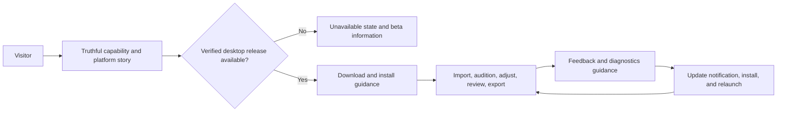
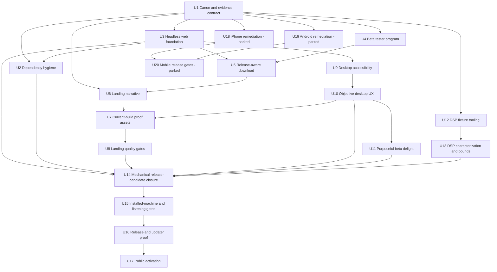
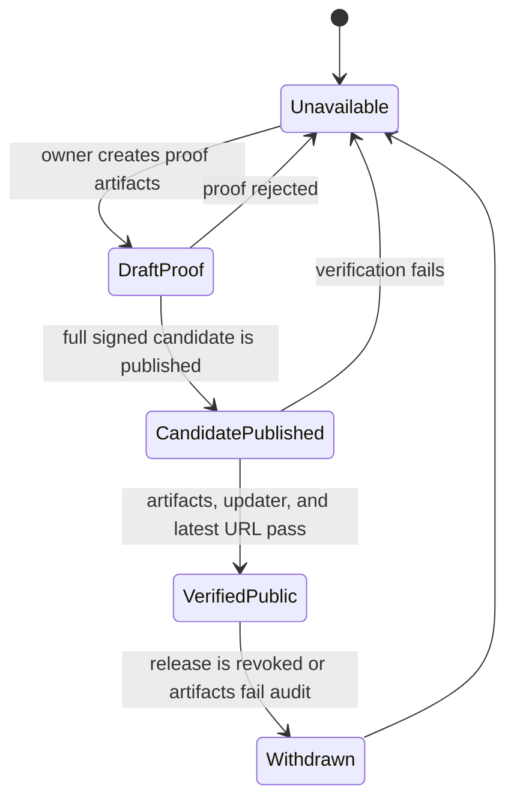

# YES Master Public Beta Quality Program

This is an implementation plan, not an execution record. Creating it does not
authorize DSP retuning, public deployment, release publication, updater
activation, mobile expansion, or collection of private audio.

---

## Goal Capsule

### Problem

YES Master has a strong mechanically tested desktop core, but the complete
public-beta experience is not yet truthful or cohesive. The landing page can
lead to a release destination that does not contain a usable release, the beta
tester journey is not assembled, marketing proof is incomplete, several
desktop accessibility and clarity issues remain, and the evidence needed to
judge DSP safety, preset character, native installation, and updater behavior
is distributed across different proof levels.

The iPhone and Android surfaces also contain known UX gaps, but current product
policy parks mobile until the owner unlocks it. Those gaps must remain visible
without delaying the desktop beta or causing the landing page to imply that
mobile is currently available.

### Desired outcome

Produce a public desktop beta whose acquisition, first run, mastering workflow,
feedback path, installer behavior, update path, and marketing claims are all
backed by current evidence from the exact released commit. Preserve the present
sound unless mechanical evidence or owner listening establishes a reason to
change it. Make the product feel polished and alive through clear state,
feedback, motion, and copy without adding decorative friction. Lead with
budget-conscious independent artists and DIY producers, welcome casual and
emerging creators next, and let professional depth serve as proof rather than
the opening pitch. The quality bar is **assured, intelligent, and alive**:
approachable without looking cheap, and precise without feeling sterile.

### Execution posture

- Work on `main` in small, independently green slices after this plan is
  approved.
- Use headless browser and native synthetic-file tests as the default repeatable
  proof.
- Reserve installed-app computer use for behaviors a browser mock cannot prove.
- Reserve listening judgments and release/publication authority for the owner.
- Keep desktop beta readiness independent from parked mobile work.
- Do not commit private audio or private rendered masters.

### Success signals

- No public download control is active unless a complete, installable release
  exists and its destination has passed an automated availability check.
- Every public capability claim maps to current product behavior and a named
  evidence source.
- The principal visitor and desktop mastering journeys pass repeatably in
  headless Chromium at the current commit.
- Album mode remains fully usable with one, four, and twelve tracks at the
  minimum desktop size, and makes sequence-level intelligence—not just the
  selected track's controls—visually understandable.
- Meaningful interaction feedback passes reduced-motion, keyboard, performance,
  and timing-perception checks as part of beta readiness.
- Windows and macOS installation, signing, first run, and update evidence are
  recorded against the exact release commit.
- DSP hostile-input tests remain finite and bounded; preset adaptation and
  character remain mechanically distinct enough to justify listening rather
  than blind retuning.
- The owner records the required listening signoffs before any preset or
  audition calibration change.
- No high or critical production or development dependency advisory remains
  unexplained at the release candidate.
- Mobile is described honestly as unavailable for the desktop beta and remains
  non-blocking until an explicit owner decision changes its status.

---

## Product Contract

### Actors

| ID | Actor | Need |
|---|---|---|
| A1 | Prospective beta tester | Understand what YES Master does, whether it is for them, what platforms are supported, and how to get it safely. |
| A2 | Desktop mastering user | Import, compare, adjust, review, export, and recover from ordinary errors without losing confidence or work. |
| A3 | Beta participant | Know what to test, what is known, how to report feedback, and how to protect private audio. |
| A4 | Owner/release operator | See exact-commit evidence, control listening and release gates, and recover signing/updater secrets. |
| A5 | Implementing agent/CI | Reproduce browser, Rust, packaging, and native bridge checks without substituting mock evidence for native proof. |
| A6 | Future mobile tester | Receive a truthful, accessible native experience only after mobile is explicitly unlocked. |

### Core flows

### Requirements

| ID | Requirement | Rule owner | Verification owner |
|---|---|---|---|
| R1 | The download control defaults to unavailable and becomes active only for a verified full release with supported desktop artifacts. | U5 | U14, U17 |
| R2 | Release availability has one internal state model covering unavailable, draft proof, published candidate, verified public, and withdrawn; visitors see only a clear Available or Unavailable state with a reason. | U5 | U16, U17 |
| R3 | The acquisition journey links supported platforms, install help, beta expectations, known limitations, privacy guidance, GitHub feedback, and an optional ungated newsletter. | U4 | U8 |
| R4 | Public copy is desktop-first and does not present parked iPhone or Android builds as currently available. | U6 | U8 |
| R5 | Every public product claim is recorded in one capability-and-evidence matrix and is either proved, qualified, or removed. | U1 | U6, U14 |
| R6 | The landing page demonstrates the full value loop: import, adaptive analysis and restraint, preset character, Intensity, Original/Mastered comparison, review intelligence, export safety, Standard/Advanced depth, and Album depth without overstating Album's current visual readiness. | U6 | U7, U8 |
| R7 | Product visuals come from a deterministic current-build capture process; stale mobile or old desktop screens cannot silently remain in the public build. | U7 | U8 |
| R8 | Landing behavior is responsive, keyboard accessible, screen-reader coherent, performant, and search/share ready across the supported viewport matrix. | U8 | U14 |
| R9 | Desktop controls expose names, state, validation, and warning detail without relying on hover-only `title` text or visual position. | U9 | U14 |
| R10 | Objective desktop UX defects—truncation, duplicate messaging, incorrect plurals, ambiguous disabled states, inadequate recovery text, and Album sequence information that is present mechanically but visually hidden—are corrected through targeted layout and interaction work. | U10 | U14 |
| R11 | Beta-critical delight work uses restrained state feedback, motion, and haptics with reduced-motion support; it must improve comprehension or responsiveness and cannot conceal latency, warnings, or audio behavior. | U11 | U14 |
| R12 | One self-contained headless command builds once, manages its own preview server, tests landing and `/app`, and tears down reliably. | U3 | U14 |
| R13 | A native Rust synthetic-WAV journey proves import through second collision-safe export and project reload without private audio. | U14 | U14 |
| R14 | DSP work in this program is sound-neutral: it characterizes adaptive behavior, bounds hostile settings, and repairs test tooling without changing preset calibration. | U12, U13 | U14 |
| R15 | Preset, audition, adaptive compressor, and other taste/calibration changes require an owner listening note before implementation. | U15 | U15 |
| R16 | The owner listening dossier explicitly covers Volume Match off/on, both A/B directions, rapid toggles, transitions, warnings, and the eight character presets on required source classes. | U15 | U15 |
| R17 | Every release-candidate proof item records commit SHA, platform, artifact/version, command or procedure, result, and evidence location. | U1 | U14, U16, U17 |
| R18 | Public activation proves installable artifacts, signing/notarization as applicable, updater manifest/signature trust, update install, relaunch, and `/releases/latest` behavior before exposing the landing download. | U16 | U17 |
| R19 | Downloading and using the beta requires no YES Master account, analytics, compulsory email capture, compulsory feedback, or private-audio upload. GitHub is the only structured feedback path and therefore requires a GitHub account; that limitation and the public-report privacy warning are explicit. | U4 | U8 |
| R20 | The known high-severity development dependency advisory is resolved in an isolated lockfile slice or documented as an accepted release exception. | U2 | U14 |
| R21 | Public GitHub beta bug and feedback forms collect reproducible metadata while clearly warning that issue contents are public. | U4 | U8 |
| R22 | iPhone and Android fixes remain documented, isolated, and non-blocking until the owner explicitly unlocks mobile work. | U18, U19 | U20 |
| R23 | Current product, landing, beta, and open-thread documents agree on scope, platform status, release truth, and remaining owner gates. | U1 | U17 |
| R24 | The $29 founder price is a public, time-limited launch window rather than a newsletter-only entitlement. Exact dates, purchase terms, public version, and publication still require owner approval and must not be inferred from stale plans. | U1 | U16, U17 |
| R25 | Updater private-key backup and recovery evidence is part of release readiness, never stored in git, and owner-controlled. | U16 | U17 |
| R26 | When beta distribution ends, beta installers are withdrawn and existing beta installs become unsupported but continue working indefinitely. There is no remote kill switch. A later optional upgrade to 1.0 may move an unlicensed user to an export-locked demo under a separately implemented and owner-approved license contract. | U4 | U17 |

### Acceptance scenario families

Each scenario below must be instantiated as a named test case or owner checklist
item with input, action, and expected result.

| ID | Input and action | Expected result |
|---|---|---|
| S-A1 | Open the production landing page before a verified release exists and activate the primary CTA by mouse and keyboard. | The page explains beta status, does not initiate a dead download, and routes to valid guidance. |
| S-A2 | Open the production landing page after a verified release exists on desktop. | Separate Windows and Mac actions lead directly to the verified `.exe` and universal `.dmg`; detection may emphasize but never silently choose a platform; install help and a secondary all-downloads/checksums link are adjacent. |
| S-A3 | Visit at 320×568, 390×844, 768×1024, 1366×768, 1440×900, and the complete existing viewport matrix. | No horizontal overflow, clipped primary action, unreadable hero, broken image, or unreachable navigation exists. |
| S-B1 | Create a draft/proof release. | The landing remains unavailable; draft or prerelease state does not satisfy `/releases/latest`. |
| S-B2 | Install the owner-approved seed build, publish the full update candidate, request an update, install, and relaunch. | Signature and manifest validation succeed, the expected version opens, and failure states offer safe retry guidance. |
| S-B3 | End beta distribution while an existing beta install is present, then decline the optional 1.0 update. | New beta downloads are unavailable, the existing beta continues working without remote deactivation, unsupported status is explained calmly, and the user is invited—not coerced—to stay informed or give feedback. |
| S-C1 | Install on a clean supported Windows machine using the published artifact. | Signing/reputation guidance, install, first launch, and diagnostics access match the beta guide. |
| S-C2 | Install on clean Intel and Apple Silicon macOS targets as required by release policy. | Architecture, signing/notarization, first launch, and diagnostics behavior match the release artifact. |
| S-D1 | Start with no track, then select an unsupported, missing, empty, mono, stereo, long, and already-mastered source. | The UI shows an accurate next action or recoverable error; it never exposes an impossible mastering/export state. |
| S-E1 | Analyze a synthetic or approved source and switch Original→Mastered, Mastered→Original, and rapidly in both directions with Volume Match off and on. | Playhead is preserved; no near-zero dip, directional stall, stale readiness error, or inconsistent state is observed. |
| S-E2 | Select each character preset across representative bright, boomy, dense, wide, already-mastered, and normal profiles. | Mechanical fingerprints remain finite and distinguishable; subjective safety and character are recorded by the owner before any retune. |
| S-F1 | Complete Standard and Advanced single-track workflows, including warnings and validation. | All controls are named, selected states are announced, warning details are readable, and exports remain collision-safe. |
| S-F2 | Complete Album mode with one, four, and twelve tracks, long filenames, mixed channel counts, follow/override states, and warnings at 1360×740 and 1440×900. | Ordering, sequence arc, common settings, per-track loudness/role/status, channel resolution, override state, warnings, and recovery are scannable, coherent, keyboard accessible, and not dependent on clipped labels. |
| S-F3 | Export twice to the same intended destination, then save and reload the project. | Prior renders are not overwritten by default, receipt actions resolve correctly, and the restored project is usable. |
| S-G1 | Submit a beta bug and general feedback without a YES Master account. | GitHub's account requirement is disclosed before the handoff, required reproducibility fields are present, and the user is warned not to publish private audio. |
| S-G3 | Subscribe, decline, unsubscribe from, or ignore the optional newsletter. | Download access and product behavior never change; consent and unsubscribe behavior are clear; the newsletter can announce beta milestones, feedback prompts, and the public founder-price window without manufacturing urgency. |
| S-G2 | Simulate offline, manifest, signature, and install failure during update. | The installed build remains usable and presents actionable retry or manual-download guidance. |
| S-H1 | Run the owner listening dossier on the exact release-candidate commit. | A dated note records sources, settings, observed issues, and explicit signoff or rejection; silence is not treated as approval. |
| S-I1 | Read the beta landing and guides as a mobile visitor while mobile remains parked. | The page truthfully says the desktop beta is the available product and does not promise a mobile download or parity. |

---

## Planning Contract

### Key technical decisions

| ID | Decision | Rationale |
|---|---|---|
| KTD1 | Use a phased truth-first program rather than a single redesign/release batch. | Release truth, product behavior, listening judgment, and public deployment have different owners and failure costs. |
| KTD2 | Keep the download safely unavailable by default; inject a verified release state at build/deploy time. | A runtime GitHub API dependency introduces rate, CORS, and availability failure modes into the primary CTA. |
| KTD3 | Treat a full non-prerelease GitHub release—not a draft or prerelease—as the state that can satisfy `/releases/latest`. | This matches GitHub release routing and prevents a proof artifact from becoming a public promise. |
| KTD4 | Use GitHub issue forms as the only structured beta feedback path at launch. | It creates structured, searchable reports without a YES Master account, analytics, or a new feedback vendor; the GitHub-account requirement is disclosed rather than hidden. |
| KTD5 | Maintain one capability-and-evidence matrix as marketing truth control. | Copy review alone cannot prevent a current-looking but unproved claim from shipping. |
| KTD6 | Make current-build visual capture deterministic and budgeted. | Hand-replaced screenshots drift; deterministic scenarios make stale proof visible in CI and review. |
| KTD7 | Use layered proof: browser headless journeys, native Rust synthetic E2E, then installed-machine and listening gates. *(session-settled: user-directed; chosen over computer-use-first breadth)* | `/app` preview mocks cannot prove dialogs, signing, updater installation, native audio, or subjective sound. |
| KTD8 | Preserve current DSP output in mechanical remediation units. | Preset character and safety are listening questions; hostile-state bounds and runner correctness can be fixed independently. |
| KTD9 | Keep mobile in an owner-unlocked phase with an honest public status. | Desktop-first is current product policy and mobile UI work should not create a false beta-readiness dependency. |
| KTD10 | Include the validated desktop, landing, release, testing, sound-neutral DSP, and purposeful-polish findings in beta scope. | The owner explicitly chose a comprehensive quality pass; only mobile implementation, listening-gated retuning, parked adaptive features, beta-period paid licensing, and unbounded redesign remain out. |
| KTD11 | Treat purposeful delight as beta-critical and require reduced-motion behavior plus meaningful state feedback for every “alive” interaction. | The product should feel finished during the beta, while motion remains subordinate to comprehension, responsiveness, warnings, and audition timing. |
| KTD12 | Record release evidence against the exact commit and artifacts under test. | A green result from another checkout, rebuilt artifact, or earlier SHA is not release evidence. |
| KTD13 | Withdraw beta distribution/support without revoking installed local-first binaries; make any 1.0 export lock an optional-update licensing transition. | This preserves local-first trust while leaving a clear future commercial boundary and avoids coercing feedback. |
| KTD14 | Run future implementation directly on `main` in small green slices. *(session-settled: user-directed; chosen over feature-branch drift)* | This is the owner-selected integration model for the current checkout; it avoids a second long-lived reconciliation branch. |
| KTD15 | Lead marketing to budget-conscious independent artists/DIY producers, then casual and emerging creators, then working producers/engineers; treat all others as non-target. | This prioritizes the people most likely to value fast, local, affordable finishing without using “broke” or “nonprofessional” as public language. |
| KTD16 | Keep Album as lower-page proof of product depth until its sequence intelligence is visually legible; do not make album creators the secondary audience yet. | The headless visual review found real multi-track mechanics but severe sidebar truncation and almost no scan-level view of loudness arc, roles, targets, or coherence. |
| KTD17 | Offer explicit Windows and Mac download actions; OS detection may highlight but never silently redirect. | Platform choice is clearer, more trustworthy, and easier to recover from than a one-button auto-detection funnel. |

### Alternatives considered

| Decision area | Rejected alternative | Why not selected |
|---|---|---|
| Program shape | Big-bang landing, desktop, DSP, mobile, and release makeover | It obscures ownership, makes regressions hard to localize, and lets parked work block beta truth. |
| Release detection | Query GitHub Releases live on every landing visit | It adds a third-party runtime dependency and can fail exactly where trust matters most. |
| Feedback | Add a hosted beta portal, database, or email service immediately | It expands cost, privacy, and operational scope before the beta proves the need. |
| Mobile marketing | Show feature parity because native bridges exist | Bridge reuse is not the same as a supported, owner-approved mobile release. |
| Preset quality | Retune from screenshots, code review, or pairwise numbers alone | “Safe” and “characterful” are perceptual judgments; numbers can select cases but cannot grant signoff. |
| Visual proof | Manually maintain promotional screenshots | Manual assets age silently and are difficult to bind to a release commit. |
| QA | Declare headless tests sufficient for the entire release | Headless tests cannot prove installed native behavior, updater trust, or audible transitions. |
| Delight | Park all motion and interaction polish until after beta | The owner wants the beta to feel top quality; meaningful state feedback is now a blocker, with strict performance, reduced-motion, warning, and audition-timing constraints. |
| Engagement | Threaten deactivation or require feedback to keep using the beta | Coercion would reduce trust and bias feedback; installed beta copies continue working and participation remains voluntary. |
| Audience | Lead with professional mastering engineers or market the app as a Suno/BandLab utility | Both obscure the strongest entry wedge; those users remain credible tertiary and acquisition segments without defining the brand. |
| Album marketing | Make Album mode the secondary persona/pillar immediately | Current mechanics are promising, but the sequence-level value is visually hidden and long names/controls truncate at supported desktop sizes. |
| Download | Use one CTA that silently selects an artifact from user-agent detection | Detection can be wrong and hides the choice; explicit platform buttons are the settled interaction. |

### Settled owner decisions

- GitHub issue forms are the only structured beta feedback mechanism at launch.
- Feedback is encouraged and never compulsory; no copy threatens deactivation.
- Download remains ungated. The newsletter is optional and separate from access.
- The $29 founder price is a public, time-limited launch window rather than a
  newsletter-only reward.
- Existing beta installs continue working indefinitely after beta distribution
  and support end. No remote kill switch is added.
- The audience and brand hierarchy are KTD15 and the **assured, intelligent,
  alive** standard in the Goal Capsule.
- Suno and BandLab users are viable use-case/acquisition segments, not the
  primary brand identity.
- Album stays proof of depth until U10 makes its sequence intelligence visually
  legible.
- Purposeful delight is beta-critical under KTD11.
- Mobile remains parked and is described as not currently available.
- Future implementation runs on `main` in small green slices.

### Assumptions requiring confirmation or later owner input

- The existing Vercel project remains the public landing target.
- Landing work evolves the current visual language without becoming a wholesale
  rebrand.
- `0.9.0` is used only as the owner-controlled installed updater seed and
  `0.9.1` is the first possible full public beta candidate.
- The owner supplies the beta-end date and exact founder-window purchase terms.
- Newsletter provider, consent storage, retention, sender identity, and
  unsubscribe operations are selected and provisioned as an external-service
  implementation decision; no vendor is inferred in this plan.
- No behavioral analytics are added.
- The owner supplies or approves the public beta date, release authorization,
  and any royalty-clear Original/Mastered marketing clips.

### Explicit non-goals

- Enabling or recalibrating the Adaptive Compressor.
- Blind preset, limiter, loudness, audition, or Volume Match retuning.
- Adding accounts, payments, entitlements, analytics, or remote audio upload.
- Implementing paid licensing or 1.0 export locking during beta preparation.
- Remotely deactivating or time-bombing installed beta copies.
- Replacing GitHub Releases with a new distribution backend.
- Shipping iPhone or Android in the desktop beta.
- A wholesale rebrand or unbounded information-architecture rewrite unrelated
  to validated user problems.
- Adding decorative motion without a state, feedback, or comprehension purpose.

### Dependency graph

---

## Implementation Units

### Unit index

| Unit | Scope | Beta criticality | Depends on |
|---|---|---|---|
| U1 | Canon, claim matrix, decisions, evidence ledger | Blocker | — |
| U2 | Dependency advisory remediation | Blocker | U1, U3 |
| U3 | Self-contained headless browser foundation | Blocker | U1 |
| U4 | Beta guide and structured feedback | Blocker | U1 |
| U5 | Release-aware safe download state | Blocker | U3, U4 |
| U6 | Landing narrative and marketing truth | Blocker | U1, U5 |
| U7 | Deterministic current-build proof assets | Blocker | U6, U10 |
| U8 | Landing responsive, accessibility, performance, SEO gates | Blocker | U3, U7 |
| U9 | Desktop accessibility semantics | Blocker | U3 |
| U10 | Objective desktop clarity and recovery | Blocker | U9 |
| U11 | Purposeful delight and interaction feedback | Blocker | U10 |
| U12 | Private fixture and reference-runner correctness | Blocker | U1 |
| U13 | Sound-neutral DSP characterization and hostile bounds | Blocker | U12 |
| U14 | Exact-commit mechanical release-candidate closure | Blocker | U2, U3, U8, U10, U11, U13 |
| U15 | Installed-machine and owner listening gates | Owner gate | U14 |
| U16 | Release/signing/updater proof transaction | Owner gate | U15 |
| U17 | Public landing activation and go/no-go | Owner gate | U16 |
| U18 | iPhone impossible-state and transport remediation | Parked | U1 |
| U19 | Android semantics, scrolling, and brand foundation | Parked | U1 |
| U20 | Mobile device/store release evidence | Parked | U18, U19 |

### U1 — Reconcile product canon and establish the evidence contract

**Purpose:** Make the plan executable from current truth and remove policy
contradictions before public copy or release behavior changes.

**Primary paths:**

- `AGENTS.md`
- `CLAUDE.md`
- `docs/PRODUCT.md`
- `docs/landing-brief.md`
- `docs/OPEN_THREADS_AND_DECISIONS.md`
- `docs/plans/2026-07-07-beta-execution-plan.md`
- `docs/plans/beta-go-no-go.md`
- `src/lib/release-readiness.test.ts`

**Work:**

- Add a dated audit-remediation block to the live queue and reconcile the stale
  landing-scope parenthetical in both byte-identical agent instruction files.
- Define the capability-and-evidence matrix for every public landing claim,
  platform statement, pricing statement, and beta promise.
- Amend the landing brief so present-tense mobile claims and “no roadmap”
  language cannot contradict desktop-first product policy.
- Add an exact-commit evidence ledger to the existing go/no-go artifact rather
  than creating another release checklist.
- Record the remaining R24 dates, terms, version, and publication approvals
  without guessing answers.

**Tests and acceptance:**

- Extend `src/lib/release-readiness.test.ts` to fail when the landing brief,
  product policy, or release checklist reintroduces an unsupported current
  mobile claim or loses required release metadata.
- Given current docs, the static test identifies one authoritative source for
  platform status, release state, beta end date, and owner gates.
- `AGENTS.md` and `CLAUDE.md` remain byte-identical.

**Boundaries:** Documentation and static invariants only; no public copy,
release, DSP, or UI behavior changes.

### U2 — Resolve the isolated dependency advisory

**Purpose:** Remove the known high-severity `brace-expansion` development
dependency path without mixing dependency churn into product changes.

**Primary paths:**

- `package.json`
- `package-lock.json`

**Work:**

- Update the narrowest direct dependency path that removes the
  `rimraf`/`glob`/`minimatch` advisory chain.
- Review lockfile changes for unrelated major upgrades and preserve the current
  runtime dependency surface.
- Record any unavoidable exception in the evidence ledger with upstream
  advisory details and impact analysis.

**Tests and acceptance:**

- `npm audit` reports no unexplained high or critical advisory.
- `npm test`, `npm run build`, and the headless lane from U3 pass against the
  updated lockfile.
- Fresh dependency installation reproduces the same locked graph.

**Boundaries:** No product feature or formatting changes in this unit.

### U3 — Build the self-contained headless web verification foundation

**Purpose:** Turn the existing ad hoc landing checks into the default repeatable
browser E2E lane for landing and desktop preview journeys.

**Primary paths:**

- `scripts/verify-landing-responsive.mjs`
- `scripts/verify-app-headless.mjs`
- `scripts/verify-headless.mjs`
- `src/lib/preview-mock.ts`
- `package.json`
- `.github/workflows/ci.yml`

**Work:**

- Retain the existing landing script as the URL-driven assertion engine.
- Add a wrapper that builds once, starts its own preview server, waits for
  readiness, runs landing and `/app` checks, captures actionable failures, and
  always tears down.
- Add deterministic preview scenarios: empty, clean, warning, album, long-copy,
  export-success, and export-cancel. Album coverage includes one, four, and
  twelve tracks, deliberately long names, follow/override, reorder, warning,
  and minimum-size states.
- Complete or deliberately allowlist the preview-mock contract so
  `render:progress`, `adaptive_compression_enabled`, `guardrail_readout`, and
  `resolve_compression_plan` do not produce unexplained console warnings.
- Add a Chromium web-E2E CI job and ensure landing verification no longer
  depends on a manually started server.
- Label browser results as synthetic so they are never mistaken for native
  dialog, audio, signing, or updater proof.

**Tests and acceptance:**

- Starting with no server, one headless command completes and leaves no orphan
  preview process.
- Each preview scenario has a named test with expected visible state and
  permitted console/network behavior.
- An unrecognized preview command/listener or console error fails the lane;
  intentionally unsupported native-only behavior is named and allowlisted.
- A forced assertion failure returns nonzero and identifies viewport, route,
  scenario, and screenshot path.
- CI executes the lane on a clean checkout.

**Boundaries:** Preview/mock behavior only; it must not alter Tauri production
behavior.

### U4 — Assemble the beta tester journey and feedback contract

**Purpose:** Give testers one coherent, privacy-safe path from install through
useful feedback.

**Primary paths:**

- `docs/BETA_TESTING.md`
- `docs/BETA_INSTALL.md`
- `.github/ISSUE_TEMPLATE/config.yml`
- `.github/ISSUE_TEMPLATE/beta-bug.yml`
- `.github/ISSUE_TEMPLATE/beta-feedback.yml`
- `.github/workflows/release.yml`

**Work:**

- Create the beta guide: supported desktop platforms, what to test, known
  limitations, diagnostics, update expectations, feedback links, and privacy.
- Add structured public issue forms. Bug reports require app version/build, OS,
  install type, exact steps, expected/actual behavior, audio format metadata,
  already-mastered status, and diagnostics availability.
- Add a general workflow feedback form covering preset, loudness, Intensity,
  clarity/confusion, severity, and follow-up permission.
- Put the private-audio warning before upload/free-text fields and state that
  GitHub issues are public and require a GitHub account. Do not imply a YES
  Master account exists.
- Add an optional newsletter alongside—not in front of—the download. Define
  explicit consent, sender identity, retention, unsubscribe, abuse handling, and
  provider outage behavior before provisioning a service. Download access,
  product behavior, and founder pricing do not depend on subscription.
- Publish the beta lifecycle in calm language: installers/support are withdrawn
  at the announced end; installed beta builds continue working; an optional
  future 1.0 upgrade may use the separately approved export-locked demo model.
- Use the newsletter for useful milestones, focused feedback invitations,
  release education, and the public founder-price window—not false urgency or
  “feedback or deactivation” pressure.
- Make release notes link the install and beta-testing guides.

**Tests and acceptance:**

- Parse both issue forms as YAML and assert required fields and privacy text.
- Link-check beta/install/release references locally.
- A tester can discover reporting instructions without first encountering an
  error.
- No feedback form asks for private audio, email capture, analytics consent, or
  an unsupported platform; newsletter consent is a separate optional flow.
- Newsletter subscribe, double-opt-in if used, unsubscribe, invalid address,
  provider outage, and already-subscribed states are testable and never disable
  a download.

**Boundaries:** GitHub is the settled feedback host. The newsletter is
engagement, not a second unstructured support inbox. Selecting/provisioning its
external service requires a separate implementation-time integration review;
this plan does not infer a vendor.

### U5 — Implement a truthful, release-aware download state

**Purpose:** Eliminate the dead-primary-CTA risk and make release availability a
verified product state.

**Primary paths:**

- `src/landing/release-config.ts`
- `src/landing/BetaDownload.tsx`
- `src/landing/BetaDownload.test.tsx`
- `src/lib/release-readiness.test.ts`
- `docs/RELEASE_SIGNING_SETUP.md`

**Release state model:**

**Work:**

- Model release state explicitly and default it to unavailable when metadata is
  absent, malformed, stale, or incomplete.
- Keep the five-state release model internal. Render only **Available** or
  **Unavailable**, with a calm reason and useful next action, to visitors.
- Activate download only when version, beta end date, release URL, exact `.exe`
  and universal `.dmg` URLs, artifact sizes/hashes, and coherent updater channel
  have been verified for the deployed build.
- Render explicit `Download for Windows` and `Download for Mac` actions that
  target the verified artifacts directly. OS detection may highlight a likely
  action but cannot redirect, hide the other action, or select silently.
- Keep optional newsletter signup separate from download access. Give Linux and
  mobile honest unavailable text. Keep GitHub's release page as a secondary
  `All downloads, checksums, and release notes` destination.
- Present install guidance, platform support, and beta limitations adjacent to
  the active action.
- Give every inactive action a visible and programmatic reason; do not use a
  clickable-looking disabled button with hover-only explanation.
- Keep failure handling local and informative; do not silently fall back to a
  dead `/releases/latest` link.

**Tests and acceptance:**

- `BetaDownload.test.tsx` covers missing config, malformed config, draft,
  prerelease, verified full release, withdrawn release, each platform action,
  wrong OS detection, keyboard activation, accessible inactive reasons, and
  external-link semantics.
- `release-readiness.test.ts` rejects an active state without the beta end date,
  expected platform artifacts, or coherent updater channel.
- Preview or injected-state equivalents of S-A1, S-A2, S-B1, and S-I1
  pass. U17 alone closes their production instances.

**Boundaries:** This unit does not publish a release or enable the public state;
U16 and U17 own those transitions.

### U6 — Rebuild the landing narrative around current product truth

**Purpose:** Make the page market the complete desktop value proposition rather
than a collection of claims and stale surfaces.

**Primary paths:**

- `src/LandingPage.tsx`
- `src/LandingPage.css`
- `src/landing/Hero.tsx`
- `src/landing/ProofDeck.tsx`
- `src/landing/CrossPlatform.tsx`
- `src/landing/FinalCTA.tsx`
- `src/landing/Nav.tsx`
- `src/landing/*.test.tsx`
- `docs/landing-brief.md`

**Work:**

- Establish one visitor hierarchy: problem/outcome, credible product proof,
  workflow, character controls, safety/review intelligence, depth without
  complexity, beta expectations, and final action.
- Address audiences in the settled order: budget-conscious independent artists
  and DIY producers first; casual/emerging creators next; working
  producers/engineers third. Never publish “broke,” “nonprofessional,” or
  failure-oriented language.
- Use the adaptive-restraint pitch: YES Master analyzes what the track already
  has, adds impact where it can take it, and uses a lighter touch when the
  material is already close. Do not frame already-mastered input as an amateur
  rescue scenario.
- Show the complete capability loop from R6, including the distinction between
  Standard and Advanced without making the app look like a generic preset toy.
- Explain that character presets are starting points under one safety system;
  avoid exaggerated genre gimmicks or claims that sound is automatically
  “professional.”
- Remove or qualify unsupported mobile, price, entitlement, release, and beta
  date claims using the U1 matrix.
- Replace vague superlatives with behavior, screenshots, meters, receipts,
  comparisons, or clearly qualified beta language.
- Apply the **assured, intelligent, alive** review lens to copy, hierarchy,
  imagery, and interaction: approachable never cheap; control-room precise
  never sterile.
- Treat Album as lower-page proof of depth, not the secondary audience or hero
  promise, until U10's Album Experience acceptance passes. BandLab and Suno
  creators may appear as recognizable use cases without turning YES Master into
  a platform-specific utility.
- Explain the voluntary beta relationship, optional newsletter, non-revoking
  beta end, and public time-limited $29 founder window without manufacturing
  scarcity.
- Make desktop availability unmistakable while allowing a restrained future
  mobile note that promises no date.

**Tests and acceptance:**

- Component tests assert required capability sections and prohibited
  unsupported claims.
- Copy assertions preserve the audience order, adaptive-restraint claim,
  voluntary-feedback promise, founder-window qualifiers, and Album's
  depth-proof position.
- Each visible claim has an identifier in the U1 matrix and a current evidence
  source.
- Preview equivalents of S-A1, S-A2, and S-I1 pass with JavaScript enabled and
  with essential content still understandable when animations do not run. U17
  alone closes their production instances.

**Boundaries:** Exact founder dates and purchase terms still require owner
approval. No professional-result guarantee, platform endorsement, or
third-party/unlicensed audio.

### U7 — Produce deterministic, current-build marketing proof

**Purpose:** Ensure the landing visually demonstrates the release candidate,
not an old desktop or parked mobile build.

**Primary paths:**

- `src/assets/landing/`
- `src/lib/preview-mock.ts`
- `scripts/capture-landing-assets.mjs`
- `scripts/verify-landing-assets.mjs`
- `docs/landing-brief.md`

**Work:**

- Define canonical `/app` scenarios and viewports for hero, Standard, Advanced,
  warning/review, export receipt, and Album proof after U10's Album Experience
  gate passes.
- Capture screens from a deterministic production build and generate a manifest
  containing source commit, capture-input digest, scenario, viewport,
  dimensions, and asset hash.
- Add stale-manifest, missing-file, unexpected-dimension, and size-budget
  checks.
- Use responsive image variants and lazy loading for below-fold proof.
- Treat Original/Mastered audio proof as owner-supplied, royalty-clear, and
  optional until available; do not substitute third-party material.

**Tests and acceptance:**

- Asset verification fails when a capture input changed without a recapture, a
  required scenario is missing, or an eager asset exceeds its budget. Unrelated
  commits do not invalidate unchanged proof solely because `HEAD` advanced.
- Eager landing assets total no more than 1.5 MB unless the owner approves a
  documented exception; optional audio is excluded from that budget and is not
  shipped without approval.
- No mobile UI image appears as current desktop-beta proof.

**Boundaries:** Deterministic browser captures are marketing evidence, not
native installation or audio-quality evidence.

### U8 — Gate landing responsiveness, accessibility, performance, and discovery

**Purpose:** Make landing quality mechanical enough to stop obvious public
regressions before deployment.

**Primary paths:**

- `scripts/verify-landing-responsive.mjs`
- `scripts/verify-landing-assets.mjs`
- `index.html`
- `src/LandingPage.tsx`
- `src/LandingPage.css`
- `src/landing/*.test.tsx`

**Work:**

- Extend the existing 12-viewport matrix with primary-CTA visibility, hero
  readability, target validity, image load, focus visibility, skip navigation,
  heading order, dialog/menu state, reduced motion, and console/network checks.
- Add automated accessibility scanning and distinguish machine-detectable
  failures from manual screen-reader/zoom checks.
- Verify touch-target spacing, pointer/coarse-pointer behavior, hover-independent
  disclosure, and one-thumb access to the primary acquisition actions at mobile
  landing widths.
- Add title, description, canonical/share metadata, favicon/manifest coherence,
  and indexability appropriate to the beta state.
- Enforce responsive-image and eager-asset budgets without optimizing away
  legibility.
- Add a production-URL smoke mode for U17.

**Tests and acceptance:**

- The full viewport matrix has no horizontal overflow, broken image, clipped
  CTA, hidden legal/beta qualifier, or unreachable navigation.
- Keyboard-only acquisition completes and visible focus is never lost.
- Automated scanning reports zero serious or critical accessibility violation;
  200% zoom and reduced-motion manual checks are recorded.
- Invalid release and feedback links fail the build or production smoke.

**Boundaries:** Performance work must preserve copy clarity and visual proof.

### U9 — Correct desktop accessibility semantics

**Purpose:** Make the desktop app operable and understandable without relying on
visual styling or hover behavior.

**Primary paths:**

- `src/App.tsx`
- `src/components/StandardView.tsx`
- `src/components/AdvancedPanel.tsx`
- `src/components/Knob.tsx`
- `src/components/RightRail.tsx`
- `src/lib/preset-copy.ts`
- co-located `*.test.tsx`

**Work:**

- Give Standard and Advanced Intensity controls explicit accessible names and
  named-range/value output.
- Add `aria-pressed` and an accessible selected-character description to preset
  controls.
- Represent two-state and segmented choices—including Album Follow/Override—as
  selected state, not by disabling the active option.
- Replace title-only warning/check explanations with associated visible or
  screen-reader text.
- Audit focus order, keyboard operation, live status, disabled reasons, and
  error association through empty, analysis, audition, validation, export, and
  receipt states.
- Preserve the established component boundaries and visual system.

**Tests and acceptance:**

- DOM tests query every interactive control by role and accessible name.
- Preset selection announces both selected state and character description.
- Warning/critical detail remains available without hover.
- S-D1, S-F1, and S-F2 complete keyboard-only in `/app` headless scenarios.
- Installed NVDA and VoiceOver validation remains a U15 gate; DOM semantics
  cannot substitute for that evidence.

**Boundaries:** No knob interaction redesign or `.std-tile` consolidation.

### U10 — Fix objective desktop clarity, layout, and recovery defects

**Purpose:** Remove the visible rough edges that make a mechanically sound app
feel unfinished.

**Current Album evidence (2026-07-24 headless production-preview review):**
Album mode successfully held twelve tracks, selection, reorder, flow,
Follow/Override, the full per-track Advanced surface, and Export Album. It is not
yet visually ready to lead marketing: the album title and flow name clip in the
narrow rail, filenames become fragments, `Flow Amount ×1.00` has no visible
meaning, and there is no scan-level loudness arc, role, target, transition, or
coherence view. At 1360×740 the selected filename wraps while substantial main
space remains, and lower controls require more navigation. This is a
presentation-of-capability gap, not evidence that the underlying Album mechanics
are absent.

**Primary paths:**

- `src/App.tsx`
- `src/components/RightRail.tsx`
- `src/components/StandardView.tsx`
- `src/components/ExportReceiptCard.tsx`
- `src/components/AlbumPanel.tsx`
- `src/components/AlbumExportReceipt.tsx`
- `src/hooks/useTrackMaster.ts`
- `src/App.*.test.tsx`
- `src/components/*.test.tsx`

**Work:**

- Fix singular/plural text such as `1 track`.
- Remove duplicate warnings and give each warning, blocker, and advisory one
  clear owner and location.
- Make long filenames, statuses, destinations, and diagnostics readable at the
  supported minimum desktop size without concealing essential actions.
- Rework the Album rail/header so the album title, selected track, named flow,
  flow amount, and essential controls are readable instead of clipping to
  fragments such as `Name this alb...` and `Cinem...`.
- Add a sequence overview that makes Album intelligence visible: every row
  exposes enough of its name plus source/target loudness, sequence role or arc
  offset, Follow/Override, analysis/render status, and warning state to scan the
  album without opening each track.
- Explain the selected flow and `Flow Amount ×1.00` in plain language and show a
  compact sequence arc that responds to flow and ordering. Reuse existing
  analysis/settings; do not invent a hidden character or change DSP.
- Turn Follow Album/Override into one accessible segmented choice with a single
  selected-state explanation; remove redundant badge/toggle language.
- Make one-track Album mode useful or clearly explain why another track is
  needed. Make four- and twelve-track albums with long names scroll, reorder,
  select, and recover predictably at 1360×740 and 1440×900.
- Keep Delivery Format, tools, warnings, and Export Album reachable without
  ambiguous clipping in short viewports.
- Give disabled Analyze, Create Master, A/B, and Export actions an accurate,
  accessible reason.
- Verify cancel, error, retry, overwrite avoidance, receipt actions, and
  save/reload recovery text.
- Keep Original/Mastered switching semantics, export rules, and guardrail
  ownership unchanged.

**Tests and acceptance:**

- Long-copy scenarios fit at 1360×740 without inaccessible truncation or
  overlapping controls.
- Album scenarios for one, four, and twelve tracks prove full-name discovery,
  sequence scanning, reorder boundaries, selection retention, Follow/Override,
  focus order, warnings, and export reachability.
- Each impossible action is absent or disabled with a discoverable reason.
- Export cancellation does not show success; second export is collision-safe;
  receipt actions resolve to the actual output.
- S-D1, S-E1, S-F1, S-F2, and S-F3 pass in the applicable proof layer.

**Boundaries:** Targeted layout and interaction refinement is authorized where
the current UI hides capability or looks unfinished. No wholesale visual-system
replacement, Album DSP retune, or enablement of the gated adaptive compressor.

### U11 — Add purposeful beta-critical delight

**Purpose:** Make the release candidate feel assured, intelligent, and alive
through meaningful feedback after the underlying states are mechanically stable.

**Primary paths:**

- `src/App.tsx`
- `src/App.css`
- `src/components/RightRail.tsx`
- `src/components/Waveform.tsx`
- `src/components/ExportPanel.tsx`
- `src/components/AlbumPanel.tsx`
- `src/components/AlbumExportReceipt.tsx`
- relevant co-located tests

**Work:**

- Give import/drop acceptance, analysis progress/completion, preset and
  Intensity changes, Mastered readiness, Original/Mastered switching,
  warning/review-state changes, save/undo, and export/receipt completion a
  restrained acknowledgment proportional to the action.
- Give Album flow/amount changes an immediate arc-preview response; animate
  reorder, selection handoff, Follow/Override, per-track completion, and album
  receipt state only where it preserves sequence orientation.
- Let meters and waveform affordances communicate live state without continuous
  ornamental motion.
- Add concise, reversible microcopy or acknowledgment where it reduces
  uncertainty.
- Use progress and completion behavior that is honest about latency; no fake
  percent, fake waveform work, premature success, or disabled UI without an
  explanation.
- Honor `prefers-reduced-motion`, preserve focus, and avoid motion during rapid
  A/B where timing perception matters.
- Run a visual consistency pass across empty, analyzing, ready, review, blocked,
  exporting, receipt, Album, and error states using the three brand adjectives.

**Tests and acceptance:**

- Reduced-motion mode removes nonessential transitions while preserving state
  comprehension.
- Interaction timing does not change audition, playhead, render, or export
  semantics.
- No motion produces layout shift, captures input, obscures warnings, or
  delays an action.
- Automated timing assertions cover rapid A/B, analysis completion, reorder,
  cancel/retry, and export completion; screenshots cover motion-end states and
  reduced-motion equivalents.
- Every new effect has a named comprehension, orientation, confirmation, or
  responsiveness purpose; effects without one are removed.

**Boundaries:** Delight cannot change DSP, export, persistence, or audition
semantics; cannot become ambient decoration; and cannot delay input or disguise
work. The unit is beta-critical, but any taste disagreement is resolved by
removing the questionable effect rather than expanding scope indefinitely.

### U12 — Repair private fixture and reference-runner path correctness

**Purpose:** Make documented deep DSP analysis commands reliable before using
their output to judge preset behavior.

**Primary paths:**

- `src-tauri/src/fixture_matrix.rs`
- `src-tauri/src/reference_tuning.rs`
- `src-tauri/examples/private_fixture_matrix.rs`
- `docs/TESTING.md`
- `docs/PRIVATE_AUDIO_FIXTURES.md`
- relevant Rust unit/integration tests

**Work:**

- Normalize and validate the intended output path before creating directories;
  then create only the already-validated directory and recheck the resolved
  destination before writing.
- Share the same safe output-path helper between private matrix and reference
  tuning paths.
- Keep private input discovery and output locations outside git by default.
- Make documented relative-output examples reproduce on Windows and macOS.

**Tests and acceptance:**

- A temp-directory test accepts a safe relative output outside the crate,
  creates it, and writes expected reports.
- Traversal attempts, source overwrite, and repository-private-audio insertion
  remain rejected.
- The documented commands work without path rewriting.

**Boundaries:** Runner correctness only; no DSP constants or expected listening
results change.

### U13 — Characterize adaptive DSP behavior and harden hostile settings

**Purpose:** Answer “safe but characterful?” with better evidence while
protecting the engine from hostile finite project values.

**Primary paths:**

- `src-tauri/src/dsp.rs`
- `src-tauri/src/engine.rs`
- `src-tauri/src/project.rs`
- `src-tauri/tests/preset_fingerprint.rs`
- `src-tauri/tests/preset_distinctness.rs`
- `src-tauri/tests/preset_loudness_balance.rs`
- `src-tauri/tests/project_hostile.rs`
- `src/components/AdvancedPanel.tsx`

**Work:**

- Add bright, boomy, dense, and wide `SourceProfile` characterization across
  the eight character presets.
- Pre-register the distinctness metrics, thresholds, source-profile partitions,
  and holdout fixtures before reading new aggregate results so a convenient
  metric cannot be selected after the fact.
- First report current pairwise/adapted behavior. Pin a new floor only when the
  current output passes robustly; route any collapse to U15 rather than tuning.
- Extend hostile-project coverage for enormous finite target, ceiling,
  threshold, ratio, attack, and release values.
- Clamp hostile persisted/manual values at the existing engine/settings
  boundary using current UI ranges. Document whether legacy projects are
  normalized on load, preserved in file but clamped at execution, or rejected;
  tests must pin the chosen compatibility behavior and round-trip result.
- Keep owner-gated feature defaults off and verify custom behavior is unchanged.

**Tests and acceptance:**

- All tested DSP outputs are finite, bounded, deterministic, and free of source
  overwrite.
- Adapted scenarios produce a review report naming the closest preset pairs per
  profile.
- Existing preset fingerprint, distinctness, loudness-balance, snapshot, and
  owner-gate tests remain unchanged unless a current failing assumption is
  documented.
- No preset coefficient, calibration constant, target loudness, limiter,
  Volume Match, or audition timing value changes.

**Boundaries:** Removing unused DSP calibration fields is post-beta cleanup, not
part of this unit.

### U14 — Close the exact-commit mechanical release-candidate gates

**Purpose:** Assemble all repeatable evidence on one candidate commit before
using owner time or release credentials.

**Primary paths:**

- `src-tauri/tests/track_master_e2e.rs`
- `src-tauri/tests/contracts.rs`
- `docs/plans/beta-go-no-go.md`
- `.github/workflows/ci.yml`
- frontend, Rust, iPhone Rust, and Android Rust verification paths

**Work:**

- Add a synthetic-WAV native flow: import, analyze, waveform, render,
  re-analyze, export validation/receipt, collision-safe second export, project
  save, and reload.
- Produce exact-commit draft installable artifacts and checksums before U15 so
  installed-machine testing exercises the same bytes that can later be promoted;
  do not publish them or activate public availability in this unit.
- Run the frontend, landing/headless, Windows packaging, Rust, slow real-fixture,
  iPhone bridge, Android bridge, advisory, and current remote CI gates required
  by touched paths.
- Record exact SHA, platform/toolchain, result, artifact, and evidence location
  in the existing go/no-go ledger.
- Mark browser synthetic, native synthetic, private-fixture, installed-machine,
  and owner-listening evidence distinctly.

**Tests and acceptance:**

- S-D1 through S-G3 have a named mechanical or explicitly deferred manual
  owner.
- The native synthetic test proves collision safety and save/reload on clean
  temp paths.
- The current-tip remote Windows, macOS, and Android lanes are green.
- No blocker is closed by evidence from a different commit.

**Boundaries:** Running an installed release, listening, publication, and
production deployment remain U15–U17.

### U15 — Complete installed-machine and owner listening gates

**Purpose:** Prove what mocks and synthetic tests cannot: installed desktop
behavior and perceptual quality.

**Primary paths:**

- `docs/OWNER_SMOKE_TEST.html`
- `docs/plans/2026-07-08-beta-listening-runbook.md`
- `docs/plans/beta-go-no-go.md`
- `docs/reviews/2026-07-13-windows-e2e-report.md`

**Work:**

- Refresh the listening runbook with the unresolved bidirectional A/B dossier
  from R16 and exact preset/source assignments.
- Install the candidate artifacts on clean supported Windows and macOS targets,
  including required Apple architectures.
- Exercise native dialogs, long-source analysis, playback, cancel/retry,
  diagnostics, export reveal/open, restart, and uninstaller behavior.
- Complete keyboard-only plus installed NVDA on Windows and VoiceOver on macOS
  for import, analysis, A/B, presets, warning detail, Album Follow/Override,
  export, and receipt recovery.
- Review Album mode visually at 1360×740 and 1440×900 with one, four, and twelve
  tracks to confirm the sequence overview, long-name discovery, right-rail
  reachability, and interaction feedback survive the installed webview.
- Have the owner listen to normal, already-mastered, long, bright, boomy, dense,
  and wide cases; compare all eight presets and clean-vs-warning exports.
- Where practical, randomize labels and level-match comparisons so preset
  expectation and loudness do not masquerade as character; keep the final
  in-context workflow pass named and realistic.
- Record explicit accept/reject notes. If a preset sounds gimmicky, unsafe, or
  indistinct, open a separate narrow retune plan with audio examples and
  mechanical regression targets.

**Tests and acceptance:**

- S-C1, S-C2, S-E1, S-E2, and S-H1 are recorded against the exact candidate.
- No near-zero A/B dip, directional ~500 ms stall, stale readiness error, or
  playhead reset is accepted silently.
- NVDA/VoiceOver and installed Album evidence is attached to the same exact
  candidate record.
- Owner-gated listening items have an explicit signature/date or remain open.

**Boundaries:** This unit gathers evidence; it does not authorize automatic DSP
retuning.

### U16 — Prove the signing, publication, and updater transaction

**Purpose:** Establish a recoverable path from owner-controlled proof artifacts
to a full update candidate without exposing an unverified public CTA.

**Primary paths:**

- `.github/workflows/release.yml`
- `src-tauri/src/lib.rs`
- `src-tauri/tauri.conf.json`
- `docs/RELEASE_SIGNING_SETUP.md`
- `docs/plans/beta-go-no-go.md`
- release notes and generated updater artifacts

**Work:**

- Audit Windows signing, macOS signing/notarization, updater key ownership, key
  backup/recovery, least-privilege CI secret access, diagnostics redaction,
  manifest/release origin binding, artifact checksums/names, and signature
  verification.
- With owner authorization, install the designated seed build and create proof
  artifacts without activating the landing.
- Publish the owner-approved full candidate needed to prove
  `/releases/latest`, update discovery, install, relaunch, and failure recovery.
- Verify every release artifact matches the recorded commit and version.
- Exercise updater negative paths with a safe test harness for offline,
  malformed manifest, wrong origin, missing artifact, bad signature, interrupted
  install, and rollback; never corrupt the sole installed candidate to create
  evidence.
- Invalidate and rebuild/retest the candidate whenever a release-bound file
  changes after artifact construction. The ledger names which evidence survives
  and why.
- Define withdrawal/rollback behavior that returns landing state to unavailable.

**Tests and acceptance:**

- S-B1, S-B2, S-B3, S-C1, S-C2, and S-G2 pass on installed builds or the
  applicable staged lifecycle harness.
- Draft and prerelease artifacts never activate the landing state.
- Updater private material is backed up outside git and recovery evidence is
  owner-controlled.
- A failed update leaves the installed app usable and directs the user to safe
  retry/manual recovery.

**Boundaries:** Publishing artifacts and handling secrets require explicit owner
authorization. This unit does not deploy the public landing state.

### U17 — Activate the public beta and complete go/no-go

**Purpose:** Make public availability the final verified transition, not an
optimistic landing-page switch.

**Primary paths:**

- Vercel project configuration and environment
- `src/landing/release-config.ts`
- `docs/plans/beta-go-no-go.md`
- `docs/BETA_TESTING.md`
- production landing URL

**Work:**

- Install the Vercel CLI prerequisite with `npm i -g vercel` before deployment
  work; it is not installed at plan creation time.
- During U1/U3 implementation setup, verify the intended Vercel project,
  credential access, and preview capability early so final activation is not the
  first platform contact. Keep deployment itself in U17.
- Pull/inspect the intended Vercel environment and set the verified release
  metadata without committing secrets.
- Build from the exact release commit, deploy a preview, run the production-mode
  landing suite, then deploy the owner-approved public state.
- Verify production download, guides, feedback links, metadata, responsive
  behavior, accessibility smoke, `/releases/latest`, artifact identity, and
  update channel.
- Close the go/no-go ledger only when all blockers and owner gates are explicit;
  immediately withdraw the active state if release verification regresses.
- Add a scheduled/operational availability check for the two artifact URLs,
  hashes, release state, install guides, issue forms, newsletter link, and update
  manifest. Define alert ownership, stale-release timeout, and the automatic or
  manual transition back to the public Unavailable state.

**Tests and acceptance:**

- S-A1 through S-H1 and S-I1 pass or have an explicit owner-accepted
  exception.
- The production CTA resolves to the verified full release and expected desktop
  artifacts.
- Production smoke is recorded against the deployed build and release commit.
- Mobile remains non-current and the landing contains no unsupported entitlement
  or unapproved price/date promise.

**Boundaries:** Deployment, publication, pricing/date copy, and beta announcement
all require explicit owner authorization.

### U18 — Remediate iPhone impossible states and transport UX (parked)

**Purpose:** Preserve a concrete mobile-quality path without making it a desktop
beta dependency.

**Primary paths:**

- `apps/iphone-native/YESMasterNative/ContentView.swift`
- `apps/iphone-native/YESMasterNative/AuditionController.swift`
- `apps/iphone-native/YESMasterNative/LiveAudioEngine.swift`
- `apps/iphone-native/YESMasterNativeTests/AuditionControllerTests.swift`

**Work after owner unlock:**

- Publish `canSelectSide`, `canCreateMaster`, playback position, and duration
  from the controller.
- Gate Original/Mastered and Create Master so the UI cannot enter an impossible
  state.
- Replace decorative transport with a real time/playhead slider and seek path.
- Add accessible names, values, disabled reasons, haptic restraint, and
  reduced-motion behavior.

**Tests and acceptance:**

- Controller tests cover no source, analysis, master unavailable/available,
  seeking, switching, interruption, and export readiness.
- UI tests prove impossible sides/actions cannot be selected and VoiceOver
  receives current state.
- Shared Rust changes, if any, pass desktop, iPhone, and Android bridge lanes.

**Boundaries:** No distribution, parity claim, or desktop-beta dependency.

### U19 — Remediate Android semantics, scrolling, and brand foundation (parked)

**Purpose:** Resolve known Compose usability gaps before a future Android beta.

**Primary paths:**

- `apps/android-native/app/src/main/java/**/MainActivity.kt`
- `apps/android-native/app/src/main/java/**/AuditionController.kt`
- `apps/android-native/app/src/main/java/**/MasteringViewModel.kt`
- `apps/android-native/app/src/main/java/**/ui/theme/`
- `apps/android-native/app/src/test/`
- `apps/android-native/app/build.gradle.kts`

**Work after owner unlock:**

- Add semantics/content descriptions and state/value announcements to Intensity,
  seek, Volume Match, A/B, create, and export controls.
- Make the completion/receipt surface scroll safely on small devices and large
  text.
- Extract the inline color scheme into a small YES Master theme layer before
  attempting visual branding.
- Add Compose UI tests and choose an emulator/device lane explicitly.

**Tests and acceptance:**

- Compose tests cover TalkBack semantics, disabled states, scrolling, large
  font, dark/light policy, interruption, and receipt actions.
- JVM controller/view-model tests remain green.
- A physical-device pass covers background audio and platform file flows before
  any release claim.

**Boundaries:** No store work or desktop-beta dependency.

### U20 — Establish mobile release evidence (parked)

**Purpose:** Define the proof needed if the owner later promotes either native
surface from bridge parity to a supported product.

**Primary paths:**

- `docs/IPHONE_APP.md`
- `docs/IPHONE_APP_OVERVIEW.md`
- `docs/plans/2026-06-12-iphone-shippability-plan.md`
- `docs/ANDROID_NATIVE_SPEC.md`
- `docs/PRODUCT.md`
- `docs/plans/beta-go-no-go.md`
- native CI and store-signing configuration

**Work after owner unlock:**

- Define platform-specific capability matrices rather than assuming desktop
  parity.
- Add physical-device, interruption/background audio, thermal/long-source,
  accessibility, signing, privacy, diagnostics, and store-artifact gates.
- Create separate go/no-go decisions for iPhone and Android.
- Update public copy only after the applicable platform passes its own evidence
  contract.

**Tests and acceptance:**

- Each mobile claim maps to device evidence and a released artifact.
- Shared-engine parity is distinguished from UI, OS integration, and store
  readiness.
- Failure of either mobile lane cannot withdraw or delay an otherwise valid
  desktop beta.

**Boundaries:** Parked until an explicit owner decision.

---

## Verification Contract

### Evidence layers

| Layer | Proves | Does not prove |
|---|---|---|
| Browser headless | Responsive layout, deterministic UI journeys, keyboard semantics, link/asset behavior, preview-state handling | Native dialogs, real audio device behavior, signing, updater install, listening quality |
| Frontend unit/component | State rules, copy invariants, accessible names/states, deterministic rendering | Cross-page integration or installed behavior |
| Native Rust synthetic E2E | Engine/import/render/export/project contracts with generated audio | Installed shell integration, real device output, subjective sound |
| Private fixture analysis | Behavior on representative real program material without committing audio | Owner preference or public licensing |
| Installed-machine computer use | Installer, OS dialogs, file flows, updater, app shell, artifact identity | Subjective audio quality by itself |
| Owner listening | Character, safety, transition perception, real-world confidence | Broad mechanical regression coverage |
| Production smoke | Deployed landing, public links, current release artifacts, public metadata | Future availability or offline installed behavior |

### Required command families

The implementing units use the repo’s current commands and update this section
if package scripts change:

- Frontend: `npm test`, `npm run build`
- Landing/browser: `npm run verify:landing`, the U3
  `npm run verify:headless`
- Windows package: `npm run build:windows`
- Fast aggregate: `npm run verify:fast`
- Rust formatting/lint/tests: the `target\codex-rc` commands in `AGENTS.md`
- Slow private-fixture lane: `AMS_RUN_REAL_FIXTURE=1` as documented in
  `docs/TESTING.md`
- iPhone bridge: `cargo check --all-targets`, `cargo test`
- Android bridge: host `cargo test` and arm64 API 29 `cargo ndk check`
- Dependencies: clean install and `npm audit`
- Remote: current-tip Windows, macOS, and Android CI

### Gate policy

- A unit is complete only when its named tests pass and its documentation/state
  owner is updated.
- Objective findings gain mechanical regressions wherever practical.
- Listening-dependent findings remain open until a dated owner note exists.
- Browser preview success never closes a native or listening gate.
- A public state cannot be inferred from a draft, prerelease, local build, or
  prior commit.
- Release evidence is invalidated by a new release commit unless the check is
  demonstrably commit-independent and the ledger says why.
- Private audio paths and outputs are inspected before staging; they remain
  outside git.

### Confidence checks before public activation

1. Requirements R1–R26 each map to an implementation unit and a verification
   owner.
2. Scenario families S-A through S-I each have a passing result, explicit parked
   status, or owner-accepted exception.
3. All blocker units among U1–U14, including U11, are green on the exact
   candidate commit.
4. U15 owner evidence is signed off or the release remains blocked.
5. U16 proves full release and updater behavior without activating a dead CTA.
6. U17 production smoke proves that deployment, release, and public copy agree.
7. U18–U20 remain parked unless separately authorized and cannot appear as
   current public capability.

---

## Definition of Done

The desktop public beta is ready only when all of the following are true:

- Product canon, landing brief, beta guide, open-thread ledger, and go/no-go
  agree on desktop-first scope and current owner decisions.
- The download control is safely unavailable by default and active only for the
  verified full release; Windows and Mac actions resolve directly to the audited
  artifacts and no detector silently chooses for the visitor.
- The landing page explains and proves the complete Track Master workflow,
  adaptive restraint, preset character, safety/review behavior, Album depth, and
  export confidence for the settled audience hierarchy without unsupported
  mobile, professional-result, price/date, entitlement, or release claims.
- Public copy and interaction meet the assured/intelligent/alive standard. Album
  sequence intelligence is scannable in the app before Album is promoted beyond
  lower-page depth proof.
- Deterministic current-build assets, all supported viewports, keyboard
  navigation, automated accessibility, performance budgets, and production
  links pass.
- Desktop accessibility, objective UX blockers, and purposeful beta delight are
  complete without changing core mastering/export semantics; reduced-motion and
  audition-timing checks pass.
- The dependency audit has no unexplained high or critical result.
- Headless browser, frontend, Rust, synthetic native E2E, private fixture,
  packaging, iPhone bridge, Android bridge, and current-tip remote CI evidence
  are green where applicable.
- DSP characterization and hostile-input results are finite and bounded, with
  no unapproved preset or calibration change.
- The owner completes the installed Windows/macOS and listening dossiers on the
  exact candidate.
- Signing, notarization as applicable, updater trust, update install/relaunch,
  withdrawal behavior, and key recovery are proved.
- Production landing, release artifacts, install guides, beta guide, feedback
  forms, optional newsletter, and update channel agree after deployment.
- Feedback remains voluntary; download is ungated; public GitHub/account
  limitations and private-audio warnings are explicit.
- Beta-end behavior is proved: installers/support can be withdrawn, installed
  beta copies are not remotely disabled, and any future 1.0 export lock remains
  an optional-update licensing transition outside this program.
- Mobile remains honestly parked unless it separately passes U18–U20.
- The owner explicitly authorizes publication and any final price/date/beta
  announcement.

---

## Sources and Research

### Current repo authority

- `AGENTS.md`
- `docs/PRODUCT.md`
- `docs/APP_BEHAVIOR.md`
- `docs/ARCHITECTURE.md`
- `docs/TESTING.md`
- `docs/RELEASE_STABILIZATION.md`
- `docs/OPEN_THREADS_AND_DECISIONS.md`
- `docs/plans/2026-06-30-launch-plan.md`
- `docs/plans/2026-07-07-beta-execution-plan.md`
- `docs/plans/2026-07-08-beta-listening-runbook.md`
- `docs/plans/beta-go-no-go.md`
- `docs/BETA_INSTALL.md`
- `docs/RELEASE_SIGNING_SETUP.md`
- `docs/reviews/2026-07-13-windows-e2e-report.md`

### External beta-program patterns reviewed

- Ableton Beta Program:
  <https://www.ableton.com/en/beta/>
- Ableton Live Beta FAQ:
  <https://help.ableton.com/hc/en-us/articles/115001663870-Live-Beta-FAQ>
- Adobe Creative Cloud Beta:
  <https://helpx.adobe.com/creative-cloud/beta.html>
- Apple Beta Software Program FAQ:
  <https://beta.apple.com/faq>

These references informed the separation of supported platforms, known
limitations, structured feedback, update expectations, and explicit beta risk.
They do not override YES Master’s current repo authority or local-first product
contract.
