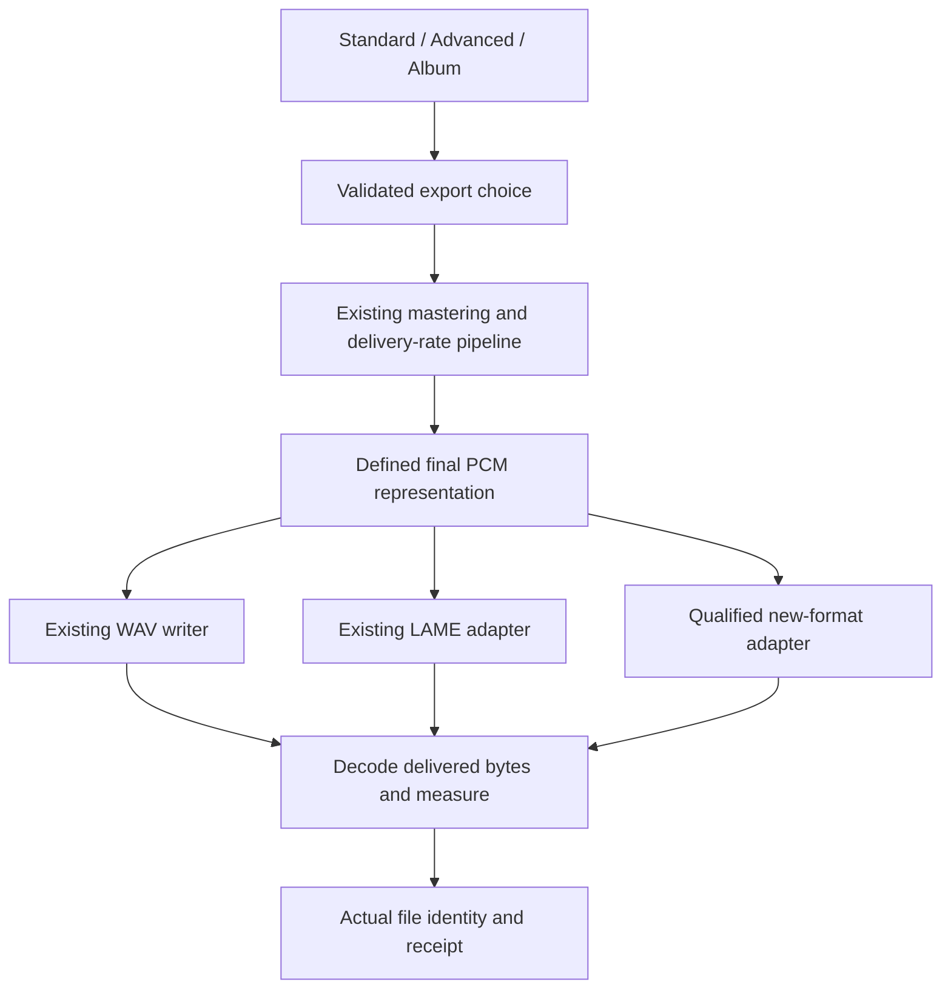
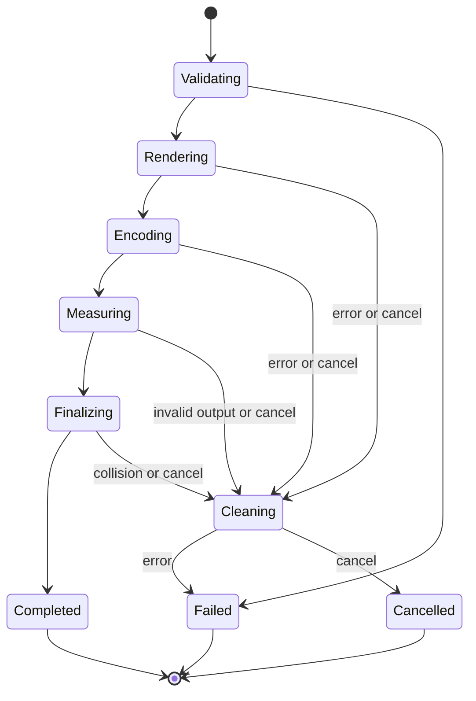

# Export Formats and Public Beta Launch - Plan

## Goal Capsule

- **Objective:** Users can master audio into the major delivery formats and download a verified Windows or Mac public beta.
- **Authority:** Current owner decisions and `AGENTS.md` govern implementation; `docs/plans/beta-go-no-go.md` owns release clearance. This plan details the export work feeding the existing quality plan, rather than replacing that program.
- **Baseline:** Installed Windows 0.9.2 / `07021f1b` passed all five owner checks. Exact scope and hashes are in `docs/listening/2026-09-09-installed-check.md`; documentation checkpoint is `515f1cad`.
- **Execution:** Implement and verify the units in dependency order, with small coherent checkpoints. Record actual progress in `docs/OPEN_THREADS_AND_DECISIONS.md` and release evidence in the go/no-go ledger.
- **Boundaries:** Pause only work dependent on an unresolved product decision, an encoder qualification failure, or missing release authority. Continue independent preparation. Publication is a separate transaction after a concrete candidate exists.
- **Ownership:** The implementing agent owns engineering, automated verification, packaging and release preparation. The owner supplies new listening judgments, unavailable real-machine checks, release date and publication decisions when the corresponding artifact is ready.

---

## Product Contract

### Summary

Complete desktop export support for the audio families already accepted by import, then prepare and activate a fresh public beta.
The recommended launch set is WAV, MP3, FLAC, AAC in M4A, standalone AAC, Ogg Vorbis and AIFF.
ALAC and Opus remain named follow-ups under the scope assumption below.

### Problem Frame

The import picker accepts WAV, MP3, M4A, AAC, FLAC and OGG, while export offers only WAV and MP3.
The owner clarified that MP3 was an example of the desired format coverage, not the whole feature.
The latest installed Windows checks passed, leaving a sound baseline for this delivery work and a bounded route to launch.

### Key Decisions

- **Complete major-format export coverage** (session-settled: user-directed — chosen over treating WAV/MP3 as the finished scope: MP3 was an example, and imported audio families should also be exportable). Governs R1–R3.
- **Keep normal mastering export.** The existing owner decision rejects a separate converter or an Original conversion mode. Governs R2.
- **Carry forward the completed Windows checks.** September 9 closes the named questionnaire for the tested build. Governs R9.

### Requirements

**Format support and user controls**

- R1. Export must cover the currently supported import families: WAV, MP3, FLAC, AAC/M4A, standalone AAC and Ogg Vorbis. Codec/container combinations must be named precisely; a file extension does not promise every codec that container can hold.
- R2. Format selection applies to the chosen mastering settings in Standard, Advanced Track and Album batch/continuous export. It must preserve settings and keep Volume Match audition-only.
- R3. Offer additional useful formats beyond import parity, using the bounded launch recommendation in Assumptions rather than an unlimited codec catalogue.
- R4. Preserve WAV as the default and existing MP3 quality choices. Standard keeps its direct Create Master ceremony; Advanced keeps advisory review and technical failure handling from `docs/PRODUCT.md`.

**File integrity and truthful delivery**

- R5. Protect source files and prior renders, including racing destinations. Cancellation and errors must remove only job-owned temporary files and never report incomplete output as success.
- R6. Receipts must identify the actual codec, container, rate, precision where meaningful, and quality setting. Delivered audio measurements must come from decoded output, with unavailable measurements explicitly identified.
- R7. Lossless output must preserve the defined final PCM representation at the selected precision. Lossy output must preserve the intended programme and tail with documented codec delay/padding.
- R8. All advertised formats must work locally from the installed Windows and Mac packages, with no separately installed encoder, network service or first-export download.

**Release readiness**

- R9. Reuse the September 9 baseline and test changed behavior on the new candidate. Do not turn the passed questionnaire into a new broad listening assignment.
- R10. Release claims, downloads, updater metadata and installation evidence must refer to the final verified candidate. Existing signing, redistribution, accessibility and updater requirements remain governed by the live release gate.
- R11. Launch the existing free Mac+Windows beta model after applicable owner approval. Do not activate public links before downloadable artifacts have been verified.

### Scope Boundaries

This work extends desktop delivery and its documentation, tests, packaging and launch path.
Preset voicing, Adaptive Compressor activation, Phase-B activation, album-character calibration, paid 1.0 and mobile product expansion remain outside this change.
Shared mobile interfaces still require compatibility verification when touched.

The demo video remains a separate owner/media workstream; this plan does not declare the current video approved or start a replacement production.
Preserve the existing `YES_Master_Video_Packet/` work.

### Acceptance Examples

- AE1. **Covers R1, R2, R6.** A user imports FLAC, adjusts mastering, exports FLAC, and opens a valid FLAC master in another player. The receipt names FLAC and reports its delivered measurements.
- AE2. **Covers R2, R5, R7.** An Album export reflects the final track order, per-track overrides and gaps in both numbered tracks and the continuous file. A later failed encode cannot produce an all-success receipt.
- AE3. **Covers R4, R6.** A Standard user selects AAC/M4A and creates a master without an advisory modal. Any encoder failure is clear, and the receipt never labels the file WAV or assigns lossy audio a PCM bit depth.
- AE4. **Covers R8, R10.** A clean installed candidate exports each advertised format offline, then an older installed seed updates to that candidate and relaunches with the expected build identity.

---

## Planning Contract

### Assumptions

These are explicit planning recommendations, not claims of owner approval or implemented support.

- **Launch scope:** Add AIFF alongside the six import families. Defer ALAC in M4A and Opus until after beta activation; each needs its own decoder, receipt and re-import proof. This is the proposed interpretation of “and more” that keeps launch finite.
- **New quality defaults:** Use the format matrix below. Preserve existing output-rate and precision settings when compatible; present any required conversion before export without resetting those settings.
- **Backend:** Qualify a pinned, minimal FFmpeg audio sidecar for the new encodings, while retaining the existing WAV writer and LAME MP3 path. Qualification is U1's deliverable, not evidence already obtained.
- **Timing:** Finish the recommended launch formats before cutting the candidate. No calendar date is promised until encoder/package qualification passes.

### Format Matrix

The new-format settings below are proposed defaults to qualify in U1; unsupported combinations must never silently become a different file type.

| Choice | Delivered codec/container | Extension | Initial quality control | Rate and precision policy |
| --- | --- | --- | --- | --- |
| WAV | Existing PCM/float WAV | `.wav` | Existing delivery controls | Preserve current 16/24-bit integer and 32-bit float behavior |
| MP3 | Existing LAME MP3 | `.mp3` | CBR 320 default; 256/192/128 kbps | Preserve tested current rate mapping and mono/stereo policy |
| FLAC | FLAC lossless | `.flac` | Fixed compression level; no quality slider | 16/24-bit integer; retain compatible delivery rate |
| AAC / M4A | AAC-LC in MPEG-4 audio | `.m4a` | Target 256 default; 320/192/128 kbps | 44.1 or 48 kHz; no PCM bit-depth label |
| AAC | AAC-LC in ADTS | `.aac` | Same target bitrate choices as M4A | Same rates; document padding limits of ADTS |
| Ogg Vorbis | Vorbis in Ogg | `.ogg` | VBR quality 6 default; 4/8 alternatives | 44.1 or 48 kHz initially; report quality, not invented CBR |
| AIFF | Integer PCM AIFF | `.aiff` | Existing integer precision choices | 16/24-bit integer; retain compatible delivery rate |

Standard's new lossless formats use 44.1 kHz / 24-bit; new lossy choices use 44.1 kHz.
For new lossy Advanced/Album output, use 44.1 kHz for that rate family and 48 kHz otherwise, with requested and delivered rate shown separately.
When Advanced requests 32-bit float with FLAC or AIFF, present an explicit 24-bit delivery conversion and keep the user's underlying Advanced setting intact.
Do not call that conversion lossless relative to the original float buffer.

### Key Technical Decisions

- KTD1. **Separate encoding from mastering settings.** Capture an immutable export request and return explicit delivered-format facts at the existing delivery boundary in `src-tauri/src/engine.rs`. Current optional MP3 bitrate is not a sustainable format discriminator. Preserve legacy WAV entry points and deserialize older reports using defaults. Validate encoder availability before expensive rendering, with no fallback to another format. Implements R1, R2 and R6.
- KTD2. **Add a desktop encoder adapter without replacing working WAV/MP3.** U1 evaluates the sidecar assumption against platform and redistribution evidence. Per-codec native integrations remain a fallback if qualification fails, but a backend change must be recorded before dependent implementation. This avoids coupling the new formats to an unnecessary MP3 migration. Implements R8.
- KTD3. **Quantize once, then encode.** Reuse `src-tauri/src/wav_writer.rs` quantization/dither semantics for the selected integer delivery representation. Feed lossy encoders the existing processed float delivery stream. Compression must not trigger a second mastering, normalization or dither pass. Implements R2 and R7.
- KTD4. **Measure completed encoded bytes.** Generalize the streaming read-back pattern in `src-tauri/src/mp3.rs`; retain bounded memory for continuous albums. Lossless output preserves the expected frame count exactly; U1 records codec-specific lossy priming/padding tolerances before U3 uses them. Verify no lost beginning or tail rather than trimming output to satisfy a duration assertion. Qualify AIFF decoding and re-import explicitly. Implements R6 and R7.
- KTD5. **Give every export job ownership of its encoder and files.** Resolve only the packaged executable, pass argument arrays without a shell, and restrict the adapter to local owned inputs. Use bounded work, drain process output, cancel/reap the child, and finalize to a collision-safe destination. Album delivery is all-or-nothing: encode, measurement or manifest failure removes only that job's owned outputs. Never broaden execution permissions to arbitrary frontend commands. Implements R5 and R8.
- KTD6. **Keep release preparation separate from activation.** Prepare final artifacts, source/relink materials, evidence and public copy before the owner reviews the release transaction. The existing audit-blocked beta.1 bytes are not a launch candidate. Implements R10 and R11.

The FFmpeg assumption is supported by its documented audio encoders and Tauri's packaged sidecar mechanism, but neither source proves a particular binary is complete or distributable: [FFmpeg encoders](https://www.ffmpeg.org/ffmpeg-codecs.html), [Tauri sidecars](https://v2.tauri.app/develop/sidecar/).
Use an audited LGPL-compatible build configuration without GPL/nonfree components; preserve exact sources, configuration, patches, dependency notices and reproducible build instructions according to the actual license set.
The existing statically linked LAME wrapper also needs its source/relink arrangement completed; adding a sidecar does not remove that obligation. See [FFmpeg distribution guidance](https://www.ffmpeg.org/legal.html) and `THIRD_PARTY_NOTICES.md`.

### High-Level Technical Design

Album preparation supplies both individual mastered tracks and one assembled continuous PCM programme to the same delivery adapters.

This lifecycle describes new staged exports. Existing saved-but-invalid WAV reporting remains governed by R4; do not erase a delivered file simply because a later receipt request failed.

### Sequencing and Release Decisions

U1 establishes the encoder/package contract; U2 establishes shared types. U3 and U4 deliver track and Album behavior, U5 exposes it consistently, U6 proves installed artifacts, U7 prepares the candidate, and U8 activates it after approval.
Documentation and release prerequisite preparation can proceed alongside encoder work.

Before U8, present one concrete release checkpoint containing the proposed tag/version, exact SHA and artifact hashes, beta end date, updater evidence plan, public copy and any remaining owner checks.
`v0.9.2-beta.2` with app version `0.9.2` is the current proposal, not a created tag.
That version supports the older-seed updater test; an existing private `0.9.2` installation needs an explicit reinstall unless the approved candidate increases the application version.
October 31 remains a provisional beta end date.
These owner decisions are deferred to activation; they do not block export implementation.

---

## Implementation Units

### U1. Qualify and package the new encoders

- **Goal:** Establish one reproducible offline encoder package for Windows x64 and Mac Intel/Apple Silicon, including the universal Mac distribution.
- **Requirements:** R1, R3, R8; Assumptions and KTD2.
- **Dependencies:** None.
- **Files:** `src-tauri/Cargo.toml`, `src-tauri/tauri.conf.json`, `.github/workflows/ci.yml`, `.github/workflows/release.yml`, `THIRD_PARTY_NOTICES.md`, `docs/third-party/`; proposed `scripts/build-audio-encoders.ps1`, `scripts/build-audio-encoders.sh`, `scripts/verify-audio-encoders.mjs`, `src-tauri/tests/encoder_package.rs`.
- **Approach:** Pin upstream revisions and hashes, build only required audio functionality, inventory runtime dependencies, and produce source/license materials. Package the sidecar for each release architecture. Mac x86 encoder execution may use suitable CI or Rosetta, recording whether evidence is native or emulated; a physical Intel Mac is advisory under D12. Enable and qualify AIFF import/read-back support before claiming round-trip support. Keep new UI choices hidden until U3–U5 prove them.
- **Patterns:** Existing desktop-only `app-runner` feature and platform release jobs; KTD2 and KTD5.
- **Test scenarios:**
  1. Each packaged architecture runs offline without a development toolchain or encoder on PATH and produces every new matrix format.
  2. Wrong architecture, missing executable, missing dependent library or corrupt hash fails the package gate with a specific diagnosis.
  3. An independent decoder recognizes codec/container and a finite, non-silent test signal; AIFF also imports through the app decoder. Record each lossy container's measured priming/padding behavior and accepted bounds.
  4. The source/license manifest matches the binaries and build configuration actually distributed.
- **Verification:** Encoder versions, capabilities, dependency inventory and package evidence recorded for every architecture. Qualification failure blocks dependent formats, not unrelated launch preparation.

### U2. Introduce explicit export and delivered-format contracts

- **Goal:** Carry format identity through desktop requests, reports and saved data without changing current WAV/MP3 behavior.
- **Requirements:** R2, R4, R6; KTD1.
- **Dependencies:** U1's capability matrix; codec builds may continue independently.
- **Files:** `src-tauri/src/types.rs`, `src-tauri/src/engine.rs`, `src/bindings.ts`, `src/lib/api.ts`, `src/lib/export-receipt.ts`, `src/lib/export-receipt.test.ts`, `apps/iphone-native/rust/src/lib.rs`, `apps/android-native/rust/src/lib.rs`; proposed `src/lib/export-formats.ts` and `src/lib/export-formats.test.ts`.
- **Approach:** Centralize codec/container extensions and supported settings. Distinguish requested settings from actual output facts. Keep legacy MP3 bitrate fields readable; reject contradictory legacy/new requests rather than guess. Preserve existing bridge WAV entry points and give new optional fields defaults.
- **Patterns:** Existing serde compatibility fields and frontend receipt constructor.
- **Test scenarios:**
  1. Older WAV and MP3 report payloads retain their meaning and load successfully.
  2. Every new format serializes explicitly; a missing measurement cannot turn its identity into WAV.
  3. Invalid codec/container/quality combinations fail before writing output.
  4. Existing iPhone and Android facade callers build and pass behavioral tests without exposing new mobile formats.
- **Verification:** Current WAV/MP3 tests remain green and every consumer understands the new contract.

### U3. Deliver and verify new Track export formats

- **Goal:** Export the selected mastered signal into every new launch format with truthful file measurements.
- **Requirements:** R1, R2, R5–R8; AE1 and AE3; KTD3–KTD5.
- **Dependencies:** U1, U2.
- **Files:** `src-tauri/src/engine.rs`, `src-tauri/src/exports.rs`, `src-tauri/src/mp3.rs`, `src-tauri/src/wav_writer.rs`, `src-tauri/src/decode.rs`; proposed `src-tauri/src/export_encoding.rs`, `src-tauri/tests/export_formats.rs`; existing `src-tauri/tests/mp3_export.rs`, `src-tauri/tests/export_volume_match.rs`, `src-tauri/tests/export_io_hostile.rs`.
- **Approach:** Attach the adapter at final delivery. Generalize lossy advisory checks and streaming delivered-file measurement. Keep path creation, precision conversion and job cleanup under backend ownership.
- **Test scenarios:**
  1. Covers AE1. For each format, independent decode confirms codec, rate, channels, duration, non-silence and full tail.
  2. Lossless decoded samples equal the selected quantized PCM exactly; 32-bit-float conversion is explicit and occurs once.
  3. A nontrivially mastered source produces the expected mastered signal; toggling Volume Match leaves exports unchanged.
  4. High-rate, mono, stereo, silence and very short sources follow the matrix policy; lossy delay is documented rather than mistaken for lost audio.
  5. Cancel during render, encode or read-back, child failure, disk full, Unicode paths and racing destinations preserve source/prior output bytes and clean only owned files.
  6. Receipt measurement failure never invents source-based delivered measurements or loses the path to an already finalized file.
- **Verification:** Parameterized format tests plus existing WAV/MP3 regression suites pass; encoding/metering stay bounded during long-track audition.

### U4. Apply the same formats to Album output

- **Goal:** Produce valid numbered tracks, a continuous master and a consistent manifest for every launch format.
- **Requirements:** R2, R5–R8; AE2; KTD3–KTD5.
- **Dependencies:** U3.
- **Files:** `src-tauri/src/album_render.rs`, `src-tauri/src/mp3.rs`, `src-tauri/src/export_encoding.rs`, `src-tauri/src/engine.rs`; `src-tauri/tests/album_render.rs`, `src-tauri/tests/album_sample_rate.rs`, `src-tauri/tests/album_hostile.rs`, `src-tauri/tests/mp3_export.rs`, proposed `src-tauri/tests/album_export_formats.rs`.
- **Approach:** Generalize the existing float-WAV staging pattern. Encode the assembled continuous programme once. Keep final arrangement, overrides and channel resolution owned by Album planning; write actual paths/format facts into `Album/metadata/manifest.json`.
- **Test scenarios:**
  1. Covers AE2. Reorder three tracks with distinct signals and settings; decode numbered outputs and continuous audio to verify order, overrides and a configured gap.
  2. Mixed rates and mono/stereo/above-stereo sources use the resolved Album delivery format without losing channels unexpectedly.
  3. Integer lossless tracks and continuous audio preserve the defined precision; lossy continuous audio has no encoder restart at track boundaries.
  4. A later-track encode, measurement or manifest failure follows KTD5's Album cleanup rule, cannot delete another export, and produces no partial-success receipt.
  5. Manifest paths resolve to the actual chosen extensions; per-track and continuous measurements describe their own delivered files.
- **Verification:** Existing Album invariants and new format matrix pass, with no surviving private staging audio or stale manifest entries.

### U5. Finish format controls, receipts and product documentation

- **Goal:** Make every qualified format discoverable and understandable throughout desktop export.
- **Requirements:** R1–R4, R6; AE3.
- **Dependencies:** U2–U4.
- **Files:** `src/components/ExportEncodingControls.tsx`, `src/components/StandardView.tsx`, `src/components/AdvancedPanel.tsx`, `src/components/ExportReceiptCard.tsx`, `src/components/AlbumExportReceipt.tsx`, `src/hooks/useTrackMaster.ts`, `src/lib/supported-formats.ts`, `src/lib/standard-export.ts`, `src/lib/preview-mock.ts`; matching component/hook tests, `src/App.album-export.test.tsx`, `src/lib/export-receipt.test.ts`, `scripts/verify-headless.mjs`; `docs/PRODUCT.md`, `docs/APP_BEHAVIOR.md`, `docs/CAPABILITY_EVIDENCE_MATRIX.md`, `docs/TESTING.md`, help and `README.md` format claims.
- **Approach:** Reuse shared encoding controls and format metadata for chooser filters, extension normalization and receipts. Explain AAC/M4A in plain language. Show only applicable quality/precision controls and any delivery conversion; keep mastering controls untouched. Add AIFF to import only after its decoder proof. Update browser simulations for the UI contract without treating them as encoder proof. Update documentation to implemented behavior, keeping unreleased claims clearly scoped.
- **Test scenarios:**
  1. Covers AE3. Standard exports each format directly and displays the actual format and applicable quality value.
  2. Switching among formats preserves preset, Intensity, Volume Match state and Advanced delivery settings.
     Changing the selector during a running export cannot change that job's output identity or receipt.
  3. Save-dialog extensions, typed suffix normalization and returned filenames match the codec, including `.aif`/`.aiff` import aliases.
  4. Advanced retains review behavior; lossy receipts never display zero-bit or pretend 24-bit precision.
  5. Keyboard users can select formats and read errors; controls and receipts fit the supported desktop viewports and scaling checks.
- **Verification:** Frontend suites and `npm run verify:headless` pass; updated captures and capability statements match the delivered behavior.

### U6. Validate exact installed packages and affected native behavior

- **Goal:** Prove the feature works from real desktop installations, using the passed Windows baseline efficiently.
- **Requirements:** R8–R10; AE4.
- **Dependencies:** U1–U5.
- **Files:** `docs/listening/2026-09-09-installed-check.md` as preserved baseline; new candidate evidence under `docs/listening/`; `docs/plans/beta-go-no-go.md`, `docs/TESTING.md`, package verification from U1.
- **Approach:** Build from a clean exact revision with a fresh target directory and verify embedded stamps and hashes. Run installed offline exports and external playback on Windows and Mac. Reuse existing private fixtures where available; keep private outputs out of git. Audit the quality-plan U15 ledger for genuinely missing installed keyboard/NVDA/VoiceOver and Album UI evidence.
- **Test scenarios:**
  1. Covers AE4. Installed Windows and Apple Silicon Mac candidates export all advertised formats offline, with no developer PATH dependencies. Both Mac encoder architectures retain U1 qualification; a physical Intel Mac smoke remains advisory under D12.
  2. Installation/relaunch preserves the existing session and settings; actual executable identity matches the candidate.
  3. A long/high-rate source exports while audition remains usable; cancel/retry does not strand encoder processes.
  4. The owner checks only affected sound and new-format playback. Record actual findings without reopening the five baseline tests unless a relevant regression appears.
- **Verification:** Exact-build installed evidence, independent decode/player results and applicable accessibility proof are attached; Mac compilation alone earns no installed-machine pass.

### U7. Prepare the candidate and redistribution materials

- **Goal:** Produce a reviewable release package and close mechanical prerequisites before publication.
- **Requirements:** R8, R10, R11; KTD6.
- **Dependencies:** U6 for candidate completion; notices, key audit and release-copy preparation can start earlier.
- **Files:** `.github/workflows/release.yml`, `.github/workflows/ci.yml`, `THIRD_PARTY_NOTICES.md`, `docs/third-party/`, `docs/RELEASE_SIGNING_SETUP.md`, `docs/plans/beta-go-no-go.md`, `docs/OWNER_INPUT_QUEUE.md`, `docs/CAPABILITY_EVIDENCE_MATRIX.md`, `src/landing/release-config.ts`.
- **Approach:** Collect completed successful CI on the exact release revision, installers, signatures, complete checksums, notices and source/relink deliverables. Extend the release asset audit for added artifacts. Reconcile obsolete listening/updater-seed language without erasing history. Obtain applicable tag/draft authority once the exact candidate is concrete. Apply U6's installed checks to the actual final distribution artifacts; newly built release-workflow bytes do not inherit a local installer's hash-based proof. Prepare the concrete release checkpoint described above.
- **Test scenarios:**
  1. Every public artifact has a matching hash/size and required signature; missing sidecar or redistribution material fails the release audit.
  2. Updater signing key ownership, backup and recovery evidence meet quality-plan U16; invalid signatures, offline operation and interrupted downloads fail safely.
  3. The proposed release excludes the audit-blocked beta.1 artifacts and consistently identifies its own revision and version.
- **Verification:** The candidate is ready for owner review. Paid OS signing is not invented as a new requirement; follow the existing D16 decision and applicable setup evidence.

### U8. Publish, prove the updater and activate downloads

- **Goal:** Make the verified free beta available with working downloads and a proven update path.
- **Requirements:** R10, R11; AE4; KTD6.
- **Dependencies:** U7 plus applicable owner publication/date decisions.
- **Files:** `src/landing/release-config.ts`, landing release/claim tests, `.github/workflows/release.yml`, `docs/plans/beta-go-no-go.md`, `docs/OPEN_THREADS_AND_DECISIONS.md`, `docs/CAPABILITY_EVIDENCE_MATRIX.md`, `docs/CHANGELOG.md`.
- **Approach:** Use the existing full-release flow required by the configured `/releases/latest` updater endpoint. Quiet publication still makes artifacts public and requires approval. Prove installed seed `0.9.0` updating to the candidate, then enable landing downloads with verified URLs, hashes, sizes and the approved beta end date. Verify the current production domain rather than relying on stale domain notes. Use the existing Vercel project; the CLI prerequisite is `npm i -g vercel` if CLI deployment is used.
- **Test scenarios:**
  1. Covers AE4. The older installed seed discovers the release, downloads, verifies, installs and relaunches into the exact candidate with session preservation.
  2. Real GET downloads from production yield the audited artifact hashes; Mac and Windows CTAs point to the correct assets.
  3. Production landing smoke, accessibility, release metadata and expiry copy pass with downloads active.
  4. If the transaction fails, pause announcement and withdraw affected CTAs. Preserve immutable artifact history and use the documented recovery path; never assume installed clients can be silently downgraded.
- **Verification:** Live gate records successful production download and installed updater evidence. Announcement/demo publication follows its own applicable owner approval.

---

## Verification Contract

Use focused suites during iteration and the scope matrix in `docs/TESTING.md` at integration. No production tests are required merely to write this plan.

| Gate | Applies to | Required outcome |
| --- | --- | --- |
| Frontend tests and production builds | U2, U5 | `npm test`, `npm run build` and applicable Windows build pass |
| Rust formatting, lint and tests | U2–U4 | `cargo fmt --check`, clippy with warnings denied and affected library/integration suites pass using the local isolated target convention |
| Fixture lane | Before DSP/export integration | Existing `AMS_RUN_REAL_FIXTURE=1` lane passes without weakening thresholds or regenerating named private fixtures |
| Headless UI | U5 and landing changes in U8 | `npm run verify:headless` passes in pinned bundled Chromium |
| Shared bridge compatibility | U2 and later shared-type changes | iPhone `cargo check --all-targets` plus tests; Android host tests plus API-29 arm64 NDK check |
| Codec matrix | U1, U3, U4 | Independent decode, exact lossless PCM, lossy duration/tail and delivered measurements pass for every advertised format |
| Installed packages | U6 | Offline encoder presence and real export/playback on Windows and Apple Silicon; both Mac architectures qualified under U1; physical Intel smoke advisory under D12 |
| Candidate CI and distribution | U7 | Completed successful exact-revision CI, complete asset audit and redistribution materials |
| Public transaction | U8 | Real download/hash checks, installed seed update/relaunch and production smoke pass |

Code tests, headless UI, installed-machine behavior and human listening prove different things; record each in its own evidence category.
Do not reuse `07021f1b` hashes or CI as evidence for a later executable.

---

## Definition of Done

- Every launch-matrix format is available across Standard, Advanced Track and Album, meeting R1–R8 and each unit's test scenarios.
- The Windows baseline remains accurately recorded; affected new-build checks and required Mac evidence are complete.
- All verification gates applicable to the final candidate pass, and source/relink materials accompany the actual shipped encoders.
- Abandoned experimental implementations and job-owned staging files are removed; unrelated media work and private audio remain untouched.
- Candidate approval, public download activation, real updater success and production verification are recorded under R10–R11.

Export completion and candidate readiness are useful checkpoints. Neither is labelled “launched” while U8 remains unfulfilled.

---

## Sources

- `docs/plans/2026-09-05-export-options.md` — owner format clarification, WAV/MP3 settings, Album names and manifest decisions.
- `docs/listening/2026-09-09-installed-check.md` — completed Windows baseline and exact artifact proof.
- `docs/plans/2026-07-24-001-feat-public-beta-quality-plan.md` — remaining U14–U17 release work, interpreted through its current ledger and later owner decisions.
- `docs/plans/beta-go-no-go.md` — release evidence authority and audit-blocked beta.1 history.
- `docs/OWNER_INPUT_QUEUE.md` — outstanding candidate/date decisions; consult before asking the owner.
- `docs/plans/2026-06-30-launch-plan.md` and `docs/PRODUCT.md` — free desktop beta model and current product contracts.
