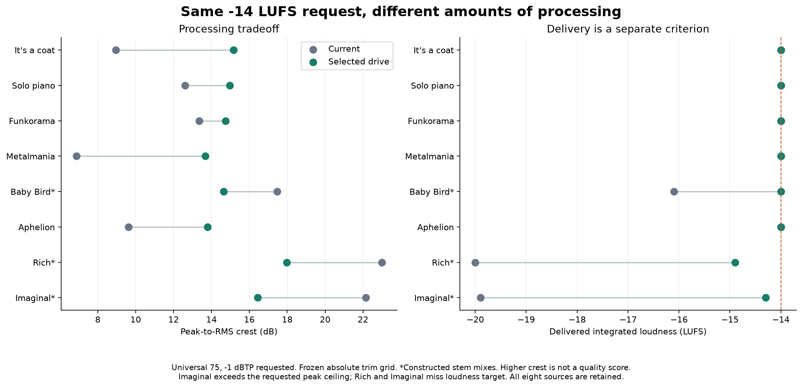
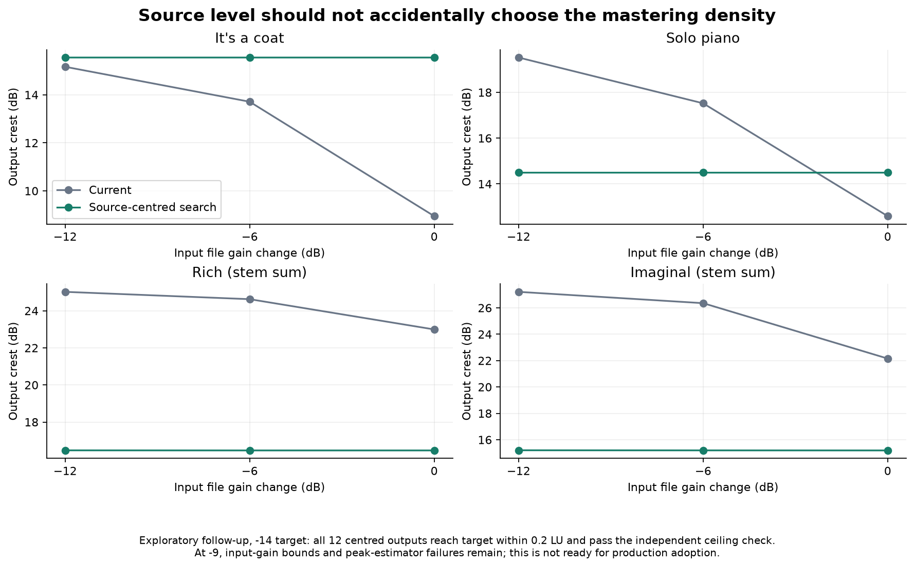
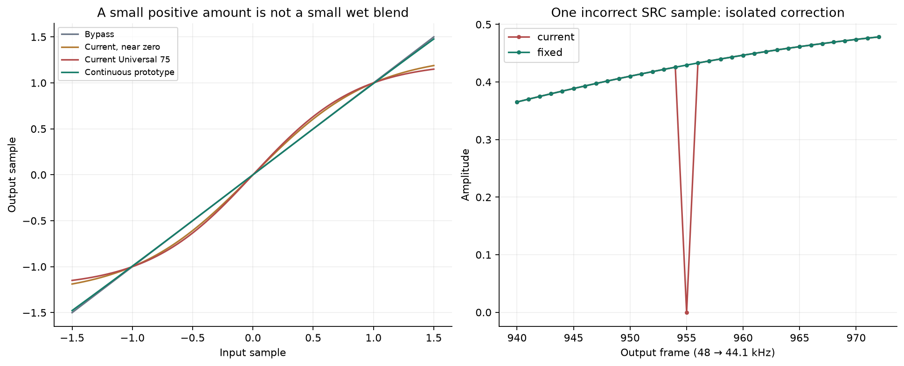

# Mastering quality: recommendation after the expanded pilot

September 14 Pacific / September 15 UTC, 2026. Investigation on clean `main`
`a4fb621d88a95b8af549467fb499943acb4274d5`. Production DSP, defaults, calibration
gates and UI are unchanged. No application release or service upload occurred.

## Decision

**YES sometimes applies avoidable peak shaping for the requested output level.**
The strongest evidence is excessive level entering saturation/limiting followed
by final attenuation. This is not primarily a reason to remove the compressor.
It is also not true for every input: quiet mixes can receive too little drive
to reach the requested target. The automatic decision should account for both
source level and delivery target.

**Recommended order:** correct the demonstrated delivery/SRC weaknesses; develop
a source-level-centred, target-aware drive selector; retain Density and Adapt as
separate functions; then calibrate saturation continuity and antialiasing. Do not
adopt a global -3 dB trim, halve every saturation coefficient, disable preset
compression, or set Adapt to 100% globally from these results.

This is an engineering recommendation, not a claimed listening win. The owner's
earlier A–E difficulty neither blocks it nor establishes equivalence. No new
listening verdict is claimed.

| Rank | Recommendation | Evidence and benefit | Cost / remaining limit | Confidence |
| --- | --- | --- | --- | --- |
| 1 | Correct SRC buffer handling and strengthen final delivered-peak verification before adopting a new automatic policy. | Reproducible wrong SRC sample and near-silent short conversions; 25/192 pilot delivery files fail the predeclared independent ceiling criterion. | Corrected SRC loop is isolated; peak estimation needs a bounded correction and integration evidence. | High for demonstrated defects/disagreement; medium for a complete peak-control solution. |
| 2 | Centre a bounded drive search on measured source level, then select the least drive meeting the target within a defined tolerance and character limits. | At -14, the exploratory centred search meets target and independent ceiling in all 12 source/level conditions; gain-shifted copies retain crest within 0.013 dB per song. | Slower than one render; less dense colour on some material. At -9, gain bounds and peak failures remain. | Medium-high for input-level consistency; medium for general automatic mastering quality. |
| 3 | Keep preset density and source Adapt; retain 0.5 defaults during investigation. | Lower density/stronger Adapt help some inputs, but do not coordinate saturation, makeup and limiting. | Full Adapt can change EQ/width and does not guarantee less limiting at equal target. | High for distinct mechanisms; medium for retaining the current numeric defaults. |
| 4 | Recalibrate saturation around a continuous identity point, with antialiasing, as a separately reviewed voicing change. | Near-zero positive amounts still shape the entire signal. Native high-frequency tests expose folded components; 4x/8x reference processing strongly reduces them. | The tested gentle mapping shifts work into the limiter and can worsen section contrast. No wholesale replacement is ready. | High for the mechanism; medium-low for the exact replacement curve/calibration. |

## Evidence and fair-comparison rules

The [frozen protocol](2026-09-15-mastering-quality-protocol.md) records ranges,
criteria and the original holdout before rendering. The original research ZIP
matched SHA-256 `a76a3ae0a95751df0c91e747a363c776ad073cb5ece22bfb54acd6de7e3b8c53`;
all 147 restored files passed verification. Both owner exports reproduce byte
for byte on this checkout, including the instrumented control. A 257-frame
processing-block rerun also reproduces the On file exactly:

- On: `639ac1dd5d049040d8b689636c08bf2890b39929b72601703d1b93938f6022ce`.
- Off: `d33c8cae3238161a8d7f812884c2137d980189485b3618def8af93a8baab6ea5`.

Native work: 384 frozen music-grid renders; 112 additional input-level renders;
192 independently decoded pilot delivery files; 156 exploratory centred-grid
renders and 24 independently decoded centred finalists; 16 additional Universal
Intensity 50 deliveries; 504 native mechanism cases; 24 SRC frequency probes;
90 current/corrected SRC comparisons. Repeated conditions are not independent songs.

The private harness uses current production analysis, DSP, SRC and deterministic
PCM24 writer. Its only source transformations disable desktop IPC wrappers,
add read-only stage statistics, and select the explicitly labelled experimental
saturation curve. Current positive saturation operations remain exact. The SRC
correction is a separate prototype, **not used in the music candidate rankings**.
Full settings, provenance and dependency locks are retained.

The text-only package was copied into a second fresh ignored directory, generated
its private modules, and built all six native binaries with the frozen Cargo
lock. Its On/Off/257-frame files again matched the owner's hashes; all 90 SRC
WAVs matched the earlier current/corrected probe outputs. A final integrity check
confirmed all 48 selected finalists came from complete 48-variant grids and
verified the saved selection rule, result counts, Python syntax and portable JSON.
No application/UI/installed lane is claimed by these research-only checks.

The music chain runs at source rate; delivery is 48 kHz PCM24, -1 dBTP requested,
at -9 and -14 LUFS. Universal 75 is the reproduced owner control. An assertion
checks that these two target choices have identical pre-landing coefficients
with Volume Match off; sharing their raw render is therefore valid. Independent
FFmpeg checks delivered LUFS/LRA/true peak; SciPy checks PCM, crest, spectrum,
stereo and source-anchored windows. All selected files have expected duration
within one output frame, stereo channels, finite PCM and no full-scale samples.
Ceiling failures are retained, not removed from the results.

Shape metrics and section differences are gain invariant. Spectrum comparisons
use whole-file RMS matching on a common 48 kHz grid. For actual playback, four
[optional targeted excerpts](../../test-output/mastering-quality-20260915/optional-comparisons/README.md)
measure -18.0 LUFS using scalar gain alone: Metalmania and piano, 60–80 seconds,
control versus drive at the -14 target. No added comparison limiter, fades,
EQ or time warping. They investigate density/attack/decay character and are not
a prerequisite or a repeat of the original A–E exercise.

## Corpus: eight pieces, three original holdouts

Seven additional pieces were acquired without payment or accounts. Their exact
media URLs, formats, credits, licenses, hashes and transformations are in the
[portable corpus manifest](evidence/2026-09-15-mastering-quality/corpus.json).

| Piece / contributor | Role and split | Source LUFS | Source crest |
| --- | --- | ---: | ---: |
| It's a coat / owner | Existing source; earlier processing unspecified; development | -12.3 | 12.72 |
| [In This Moment / Scott Buckley](https://www.scottbuckley.com.au/library/in-this-moment/) | Finished solo piano, MP3; development; CC BY 4.0 | -17.1 | 18.55 |
| [Funkorama / Kevin MacLeod](https://incompetech.com/music/royalty-free/index.html?Search=Search&isrc=USUAN1100474) | Finished bass/drums/funk, MP3; development; CC BY 4.0 | -16.1 | 17.76 |
| [Metalmania / Kevin MacLeod](https://incompetech.com/music/royalty-free/index.html?Search=Search&isrc=USUAN1700023) | Finished dense guitar/drums, MP3; development; CC BY 4.0 | -9.8 | 12.04 |
| [Baby Bird / Admiral Bob](https://ccmixter.org/files/admiralbob77/25039) | Constructed vocal/acoustic band stem sum, MP3 stems; development; CC BY 3.0 | -21.7 | 18.01 |
| [Aphelion / Scott Buckley](https://www.scottbuckley.com.au/library/aphelion/) | Finished orchestral/electronic transitions, MP3; holdout; CC BY 4.0 | -14.1 | 14.58 |
| [Rich / Hans Atom featuring Adisa McKenzie](https://ccmixter.org/files/hansatom/32556) | Constructed rock/electronic vocal stem sum, MP3 stems; holdout; CC BY 3.0 | -27.4 | 25.39 |
| [Imagining Imaginal / SackJo22](https://ccmixter.org/files/SackJo22/64781) | Constructed vocals/bowls/percussion stem sum, FLAC stems; holdout; CC BY 3.0 | -26.9 | 24.11 |

Stem sums use all supplied stems at unity relative gain, zero-padding shorter
parts and applying one scalar to reach -6 dBFS sample peak. They have no bus EQ,
compression or limiting. These are unmastered **constructed balances**, not
artist-approved premaster mixes; processing may already be baked into stems.
The quiet, high-crest constructed mixes are useful stress cases, not proof that
their balances are commercially representative. MP3 decoding preserved float
headroom: Funkorama/Metalmania already decode above full scale; no clipping was
introduced to make their inputs fit PCM integers. Gain variations only attenuate.

Rich's underlying [Adisa McKenzie vocal](https://ccmixter.org/files/adisa/28618)
also carries CC BY 3.0. License links: [CC BY 3.0](https://creativecommons.org/licenses/by/3.0/),
[CC BY 4.0](https://creativecommons.org/licenses/by/4.0/). Changes are recorded
above and in the manifest. No new audio was uploaded to a service or published.
Two creators supply the four finished downloads; this is a varied pilot,
not exhaustive genre or professional-premaster coverage.

## What the frozen drive test establishes

The grid changes only input trim (-12 to +6 dB, 1.5 dB steps), keeping all stages,
requested density 0.5 and Adapt 0.5. Select the lowest grid drive reaching the
target within 0.2 LU; otherwise retain the smallest target error, with the
predeclared tie rule. It does not select by crest or similarity to LANDR.

At **the same delivered -14 LUFS**, five finished/owner sources retain more
peak and section contrast with less drive. Their maximum RMS-matched broad-band
change versus control is 0.44–0.64 dB; M:S changes are at most 0.51 dB. This is
evidence for avoiding unnecessary processing, not proof of unchanged colour.
EQ and crossover phase can also change peaks: crest above the source's crest
is not a measurement of how many original transients were restored.

Source-anchored attack/body measurements support the direction: at -14, the
median attack-to-following-body ratio rises 7.86→10.24 dB on coat and
6.89→11.27 dB on metal. The short-term loudness spread rises 3.1→4.2 LU on
coat and 9.0→11.2 LU on Aphelion. These are specified window statistics,
not transient fidelity scores. Quiet stem mixes show the opposite attack/body
trend as more drive is needed; all rows remain in the evidence CSV.

| Source | Selected trim | Current → selected crest | Current → selected LUFS | Section contrast change |
| --- | ---: | ---: | ---: | ---: |
| It's a coat | -12 dB | 8.95 → 15.17 | -14.0 → -14.0 | +1.47 dB |
| Piano | -3 dB | 12.59 → 14.96 | -14.0 → -14.0 | +1.14 dB |
| Funkorama | -4.5 dB | 13.36 → 14.74 | -14.0 → -14.0 | +0.86 dB |
| Metalmania | -9 dB | 6.86 → 13.67 | -14.0 → -14.0 | +0.60 dB |
| Aphelion, holdout | -6 dB | 9.62 → 13.80 | -14.0 → -14.0 | +1.83 dB |
| Baby Bird | +3 dB | 17.47 → 14.64 | -16.1 → -14.0 | -0.12 dB |
| Rich, holdout | +6 dB boundary | 22.99 → 17.96 | -20.0 → -14.9 | -1.90 dB |
| Imaginal, holdout | +6 dB boundary | 22.16 → 16.43 | -19.9 → -14.3 | -0.25 dB |

The last three rows show why simply maximizing crest or turning everything down
would be wrong. Baby Bird needs more drive to reach -14; Rich and Imaginal still
miss it. Imaginal also fails the independent peak criterion. Section contrast
uses source-selected loudest/quietest active 10-second blocks, not LRA.

At **-9**, It's a coat improves from crest 8.95 to 9.87 and LRA 3.1 to 3.6 with
-1.5 dB trim, both delivered -9.0. Limiter maximum/mean GR falls from 2.46/0.43
to 2.12/0.16 dB. Metalmania's -3 dB candidate also reaches -9.0: crest 6.86→8.62,
limiter mean GR 0.79→0.29 dB. These are material mechanical improvements without
a target sacrifice.

Piano is the contrary case: achieving -9 requires +4.5 dB extra drive. Its
delivery rises from -11.2 to -9.0, but crest falls 12.59→9.77, LRA 10.3→7.8,
and section contrast falls 2.39 dB; the largest measured band change is 1.51 dB.
Funkorama's +6 candidate remains -11.5, with 1.31 dB less section contrast.
Those are regressions/costs, not improvements hidden by averaging.

Universal **Intensity 50** does not resolve the issue by itself. It gives coat
crest 9.25 and metal 7.06 at -14; their pre-landing nonlinear processing still
gets attenuated afterwards. Piano delivers -11.6 when asked for -9; Rich and
Imaginal remain about -20 LUFS. See [the default-intensity screen](evidence/2026-09-15-mastering-quality/default-intensity.json).
Other named preset voicings were not retuned or exhaustively evaluated.

## Source-level consistency: the better automatic direction

The frozen absolute grid fails on quieter copies. Coat at -9 changes from
crest 8.95/-9 LUFS to 15.17/-13.72 LUFS when its source is attenuated 12 dB,
with otherwise identical settings. The +6 dB search bound cannot recover it.
This is accidental input-level dependence, not a different musical intent.

The separately declared exploratory follow-up centres the same grid at
`-18 - measured source LUFS` and preserves production's +/-24 dB input bound.
-18 is merely a tested search coordinate, not an adopted magic operating level.
Four pieces (coat, piano, Rich, Imaginal), each at 0/-6/-12 dB source gain:

- **-14 target: 12/12** independently measured outputs reach within 0.2 LU and
  meet the independent ceiling criterion. Per-song crest varies by at most
  **0.013 dB** across the three file levels. This includes the two quiet former
  holdouts which the fixed absolute grid could not land adequately.
- **-9 target:** coat/piano remain consistent; Rich/Imaginal's -12 dB copies
  hit the production input-gain clamp and miss the target. Imaginal's three
  outputs also exceed the independent ceiling criterion (up to -0.3 dBTP).
- These are exploratory checks on already-used sources, not a new untouched
  holdout or evidence for shipping the current search unchanged.

A production design should use existing source analysis, a bounded refinement
around a source-relative operating level, final-rate peak verification and a
clear target-missed result when limits are reached. It should constrain both
delivery error and allowed processing/character change. The full 13-point grid
is an offline research reference, not an acceptable audition-time workload.
It adds repeated renders; use cached analysis and bounded refinement, then verify
the whole file. Do not activate Adaptive Compressor or confidence gates to do this.

## Density, Adapt and saturation

**Retain Density and Adapt separately.** Density describes requested preset
compression. Adapt responds to source characteristics and also affects EQ/width.
On coat at -9, density 0.25 raises crest only 8.95→9.34; Adapt 100% gives 9.28;
compressor Off gives 9.42. Stronger Adapt plus selected drive gives 10.31 and
LRA 3.8 at -9.0, but that interaction is not universal: on held-out Aphelion the
Adapt-100 search chooses extra drive and reduces LRA relative to its control.
Disabling the compressor also removes crossover phase and makeup, so these
differences are not pure gain-reduction attribution. Near-zero compressor GR
does not mean density cannot affect downstream saturation through makeup gain.

For the carried-forward UI question, recommend that the editable thumb represent
requested density: named-preset Auto at 50%, Custom Auto at 0%, with null Auto
preserved. Adapt should not move that thumb. Show resolved easing separately,
using backend values. This remains a recommendation; no UI work was performed.

**Do not merely halve saturation.** At Universal 75 the positive amount 0.0715
drives the whole signal through `tanh(x*(1+2a))/tanh(1+2a)`. At a -24 dBFS,
1 kHz native tone, bypass gives 0 dB gain, an almost-zero positive amount gives
**+2.357 dB**, half amount gives **+2.637 dB**, and current amount gives
**+2.922 dB**. The zero/positive discontinuity is real. Half amount raises coat
crest only 0.19 dB and metal 0.14 dB.

The continuous unity-small-signal-slope prototype `tanh(2a*x)/(2a)`, with identity
at zero, reduces shaping. But at equal -9 delivery on coat its searched version
needs +1.5 dB extra input and increases limiter maximum/mean GR to **6.60/0.97 dB**.
It raises crest to 10.40 while **lowering LRA to 2.6** and section contrast to
4.43 dB (control 4.93). Metal's limiter maximum reaches 9.52 dB. Piano and
Aphelion miss the loud target. More crest therefore does not justify this as a
universal replacement. At -14 its advantages over drive control alone are small
and inconsistent.

## Mechanism and delivery findings

**Aliasing:** native standalone saturation was verified against its analytical
curve (maximum error 2.22e-7). At 44.1 kHz, a full-scale 11 kHz sine generates
nonharmonic folded energy at **-21.64 dBc** with current saturation; half amount
is -22.51, near-zero positive amount -23.47, and the gentle continuous prototype
-55.41. These distinguish folded artifacts from legitimate below-Nyquist harmonics.
The same current curve with a 4x/8x oversampled analytical reference measures
-79.89/-80.60 dBc in that case. This supports antialiasing research while retaining
the curve, not a claimed 58 dB improvement in perceived music quality. Oversampling
adds filtering, latency and computation; this reference is not a production
implementation. [The primary waveshaping research](https://dafx.de/paper-archive/2016/dafxpapers/20-DAFx-16_paper_41-PN.pdf)
also documents alias-reduction approaches with their own response tradeoffs.

**Limiter:** isolated tone, multitone, burst, impulse and step cases stay finite;
independently checked limited stress cases are at or below -1.1 dBTP. Linked
limiter-only stereo keeps the tested 2:1 channel relationship exactly. A 20 ms
overload burst leaves approximately 0.56 dB attenuation at 100 ms and <0.001 dB
at 500 ms in the limiter-only case. Gentler saturation puts more of the burst
into limiter recovery; it does not simply remove a cost.

**SRC after limiting:** on Funkorama control, pre-SRC true peak is approximately
-1.10, but production 44.1→48 conversion reaches +1.04 before final landing.
At +6 drive it reaches +2.63. The final scalar protects the native-meter ceiling
by turning the whole track down, explaining part of the target miss. Independent
polyphase/soxr conversion also creates peak regrowth, with different maxima;
do not conflate this filter-dependent phenomenon with the separate buffer bug.
Final peak control belongs at the delivery rate, and changing SRC/limiter order
requires a separately measured candidate rather than an unannounced extra limiter.

**Independent peak failure:** 25/192 pilot deliveries fail the predeclared
FFmpeg criterion of <=-0.9 dBTP for a -1 request (allowing its 0.1 dB reporting
precision). All 24 Imaginal variants fail, plus Funkorama continuous-drive at
-14. No full-scale PCM samples occur. Imaginal control is -1.00 by native meter,
-0.7 by FFmpeg; 16x soxr reconstruction reaches about -0.53. Funkorama's named
candidate is -1.057 native, -0.8 FFmpeg and about -0.616 with soxr. Varying native
meter feed size from 64 frames to the full file does not change those native
readings: block feed size is ruled out for this discrepancy. The centred -9
Imaginal outputs reach -0.3 to -0.5 independently. A fixed extra margin is not
established as a general solution. Treat these as failed ceiling checks, not
proof of digital clipping or of a particular audible defect.

**Separate objective SRC buffer defect:** the Rubato 1.0.1 convenience helper
copies `frames_to_trim` useful frames when it should retain the entire useful
suffix. In the 48→44.1 case, a 1911-frame block has a 955-frame integer delay,
leaving 956 useful frames; one sample is left incorrect. For a 100 Hz, 0.5-peak
sine, output frame 955 differs by about **0.43 amplitude**. The helper also fails
to remove startup delay for very short inputs: a 10 ms test becomes nearly
silent (RMS 2.13e-8 versus about 0.354). Floating ratio ceiling can add an extra
output frame. An isolated loop using the same FFT resampler, explicit delay
removal and rational frame counting fixes all 45 tested rate/duration/frequency
combinations: exact lengths; long-tone residuals below -134 dBc; short-signal
content restored. It is ready for a separate objective-correction review and
required application/bridge/fixture checks, not silently integrated here.

**Silence/very small tails:** no NaN, infinity or growing tail was observed in
the 504 cases. Deliberately injected subnormal floats remain in the neutral
standalone path; it is not denormal-free. Tiny-tail processing was slower than
silence in these diagnostic runs (which overlapped other work). Those samples
are below roughly -758 dBFS, and these timings do not establish a native audio
deadline failure or an audible problem. This is lower priority than the demonstrated
delivery issues. Synthetic probes do not certify real-time installed behavior.

## LANDR: useful benchmark, bounded conclusion

All three saved same-source LANDR masters were freshly remeasured and their
hashes retained. Balanced: -9.4 LUFS, 3.8 LRA, 11.39 crest; Open: -9.5/3.9/11.64;
Warm: -9.5/3.9/11.07. Their ceiling is around **-0.3 dBTP**, versus YES's requested
-1.0. Source-centred coat at the -9 request gives -9.2 LUFS, crest 10.76 and
LRA about 3.9; the original frozen Adapt-plus-drive candidate gives -9.0, 10.31
crest and 3.8 LRA. This shows plausible improvement toward the reference's
dynamics while retaining YES's stricter ceiling intent, without matching all
tonal/stereo choices or proving superiority.

A gain-only ceiling adjustment of LANDR would also lower its LUFS; no added
comparison limiter is used to pretend both constraints match. LANDR's published
[loudness choices](https://support.landr.com/hc/en-us/articles/115009557127-What-are-the-LANDR-loudness-options)
explicitly involve dynamics tradeoffs. Its [engine description](https://support.landr.com/hc/en-us/articles/115009725688-What-is-LANDR-Mastering)
does not reveal a reproducible current implementation. These saved outputs are
one-source empirical evidence with unknown service versions. Longer analysis
time alone supplies no evidence of better decisions; the local results already
identify useful decisions using existing measurements.

## What should happen next

1. Separately integrate/test the demonstrated SRC correction and reproduce the
   peak-estimator failures as focused regressions. Preserve original audio and
   baseline evidence; do not weaken peak criteria to make the files pass.
2. Develop the source-centred drive selector with measured delivery verification,
   bounded work and explicit character limits. Reuse this pilot as regression
   material; reserve genuinely new sources before the next calibration round.
3. Calibrate saturation amount/antialiasing independently, then re-evaluate its
   interaction with limiting. Keep current density/Adapt controls and gates.
4. A targeted listening choice may eventually decide how much dense colour the
   automatic mode should retain. It does not need to decide mathematical SRC
   correctness, input-level consistency or whether a target was met. The optional
   new excerpts isolate that narrower character choice; no response is required now.

**Recommendation complete; production adoption remains separate.** This pilot
supports source/target-aware processing more strongly than a preset retune or
more elaborate proprietary-style analysis. Confidence in a universal perceptual
winner remains limited by corpus size, constructed balances and absence of a
new listening verdict, not by the owner's inability to rank the prior clips.

## Portable evidence

- [All 192 delivered music measurements](evidence/2026-09-15-mastering-quality/music-results.csv).
- [Source-level follow-up](evidence/2026-09-15-mastering-quality/centered-validation.json),
  [original level robustness](evidence/2026-09-15-mastering-quality/robustness.json).
- [Mechanisms](evidence/2026-09-15-mastering-quality/mechanisms.json),
  [SRC correction cases](evidence/2026-09-15-mastering-quality/src-checks.json),
  [SRC peak regrowth](evidence/2026-09-15-mastering-quality/src-regrowth.json),
  [independent peak checks](evidence/2026-09-15-mastering-quality/peak-verification.json).
- [Source/compiler provenance](evidence/2026-09-15-mastering-quality/provenance.json),
  [corpus/credits/hashes](evidence/2026-09-15-mastering-quality/corpus.json),
  [LANDR measurements](evidence/2026-09-15-mastering-quality/landr.json).
- [Reproduction scripts and instructions](../../scripts/research/mastering-quality-20260915/README.md).
- Full private audio, logs, settings, coefficient snapshots and prototypes remain
  in `test-output/mastering-quality-20260915/`. The older GitHub research draft
  remains the source for the original owner corpus; new audio has not been uploaded.
